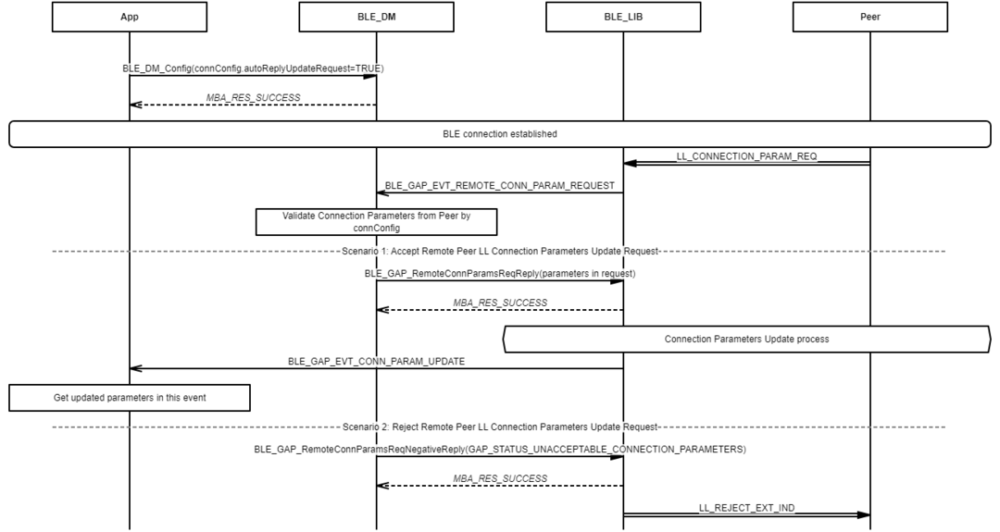

# Connection Parameters Update Procedure

## Example of automatically replying l2cap connection parameters update request from peer

 

 

## Example of automatically replying ll connection parameters update request from peer

 

 

## Example of manually initiating connection parameters update request to peer

 

 

**Parent topic:**[Message Sequence Chart](GUID-8C579DB8-1E01-44BF-B3C9-1CB390F8A7BC.md)

