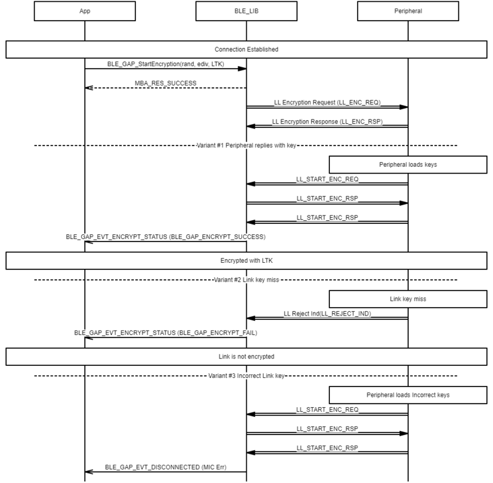

# GAP Security \(Encryption\) procedure

## Example of central security \(encryption\) procedure

 

 

## Example of peripheral security \(encryption\) procedure

 

 

**Parent topic:**[Message Sequence Chart](GUID-1A7E8B4B-B471-43E1-BC73-81D705900D18.md)

