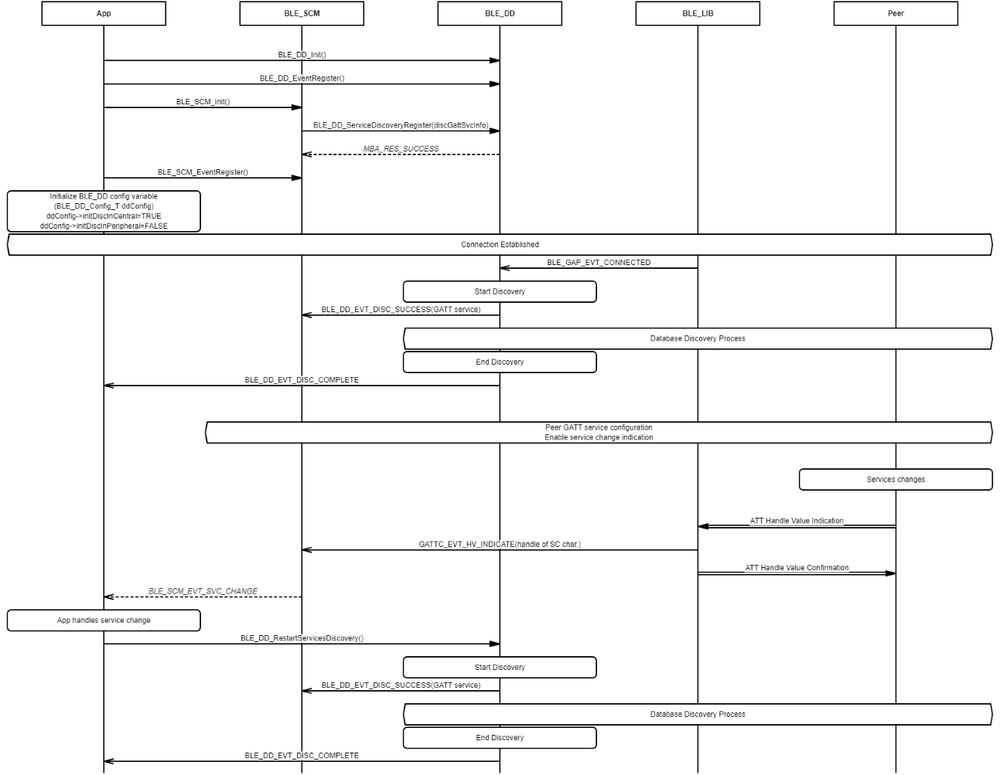
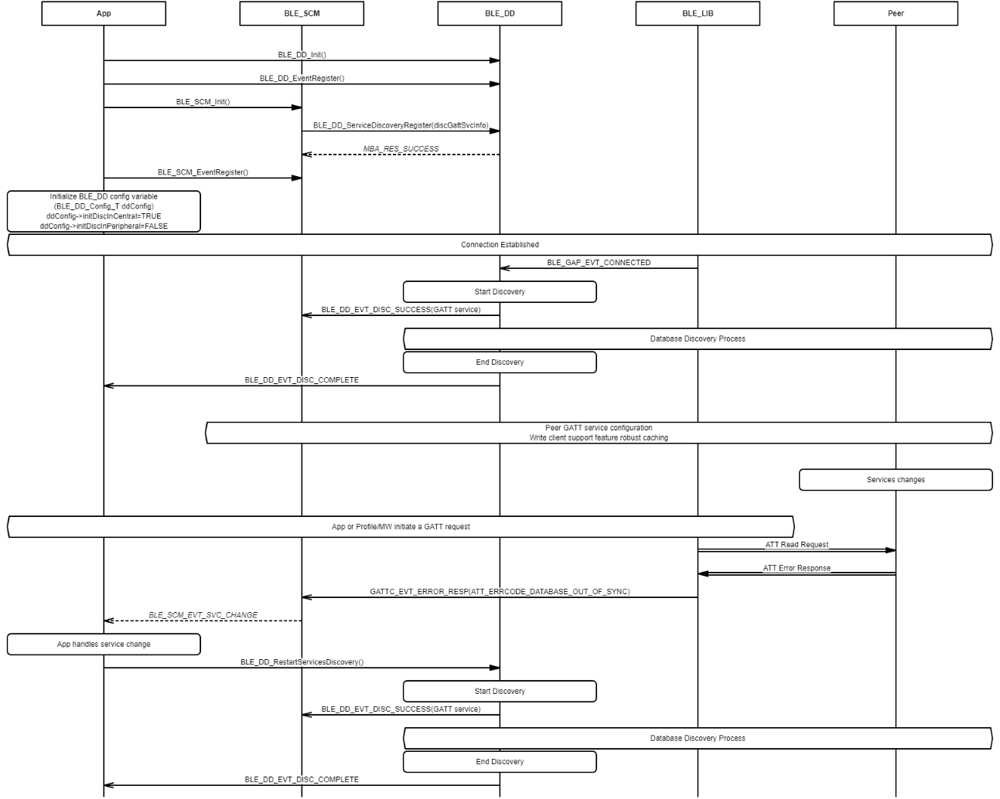

# Database Discovery with BLE\_SCM in Service Change Situation

## Example of receiving service change \(SC\) indication from peer

 

 

## Example of receiving ATT Database Out Of Sync. error code from peer

 

 

**Parent topic:**[Message Sequence Chart](GUID-7936CFC8-E8CB-4185-BFAA-2F49B1481F07.md)

