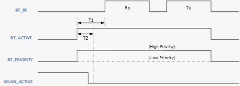
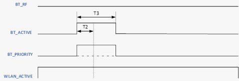
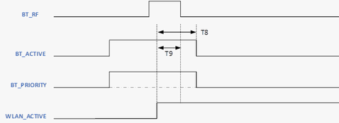

# PTA Signal Timing vs Coexistence Scenarios

-   **Scenario 1: Wi-Fi device grants BT device’s request.**
    -   T1: BT device raises the request by asserting BT\_ACTIVE signal and sets BT\_PRIORITY level before BT RF active.
    -   T2: BT device checks WLAN\_ACTIVE signal is low to confirm this request is granted by Wi-Fi device. BT device performs the BT RF activities execution continuously.

-   **Scenario 2: Wi-Fi device rejects BT device’s request.**
    -   T2: BT device checks WLAN\_ACTIVE signal is high to confirm this request is rejected by Wi-Fi device. BT device stops the ongoing BT RF preparation.
    -   T3: BT device de-asserts both BT\_ACTIVE and BT\_PRIORITY signals after stops the BT RF preparation.

-   **Scenario 3: Wi-Fi device aborts the ongoing BT RF activity by raising WLAN\_ACTIVE signal.**
    -   T9: BT device aborts the ongoing BT RF activity after detecting the WLAN\_ACTIVE signal is asserted.
    -   T8: BT device de-asserts both BT\_ACTIVE and BT\_PRIORITY signals after detecting the WLAN\_ACTIVE signal is asserted.

Below table is the summary of these timing values.

 

|Timing|Minimum\(us\)|Maximum\(us\)|
|------|-------------|-------------|
|T1|-|100|
|T2|75|80|
|T3|120|160|
|T8|-|100|
|T9|-|45|

 

**Parent topic:**[BLE PTA](GUID-C76FA981-3CAC-4973-AE4F-8FFEE405F570.md)

