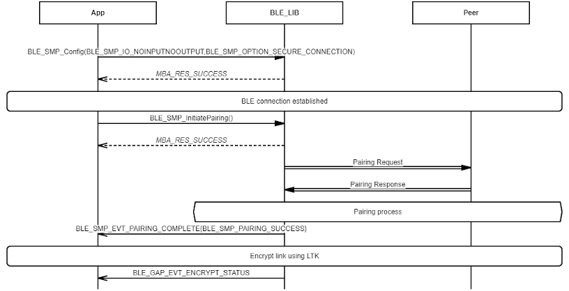
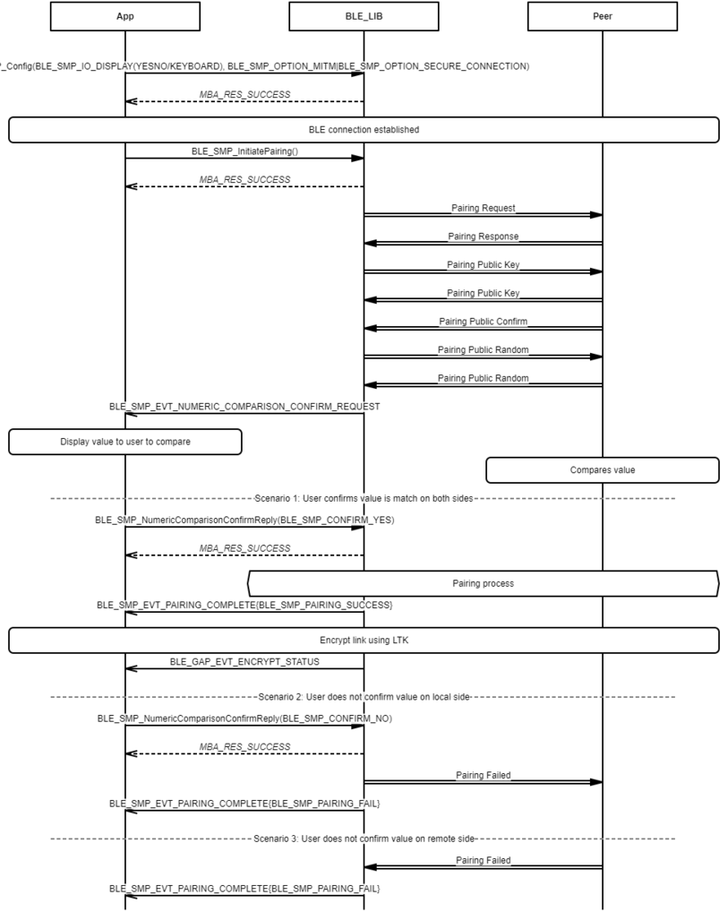
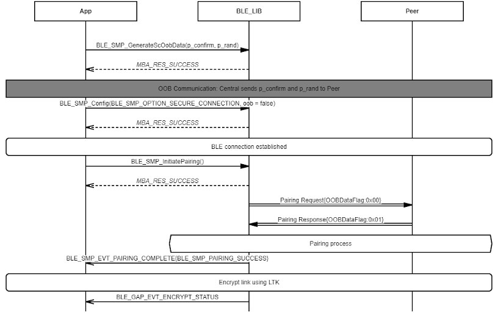
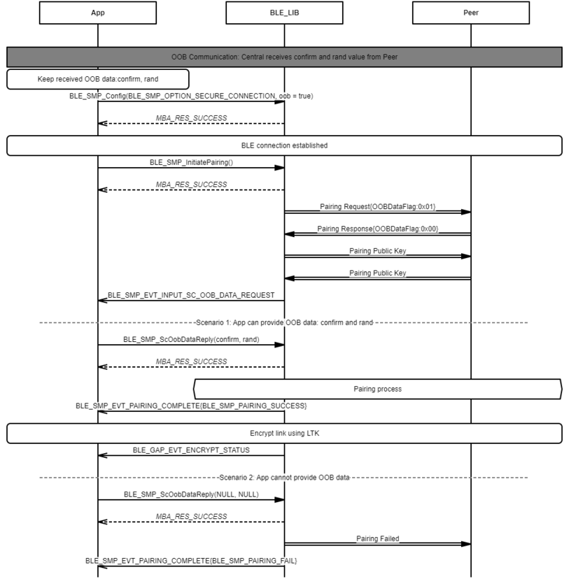
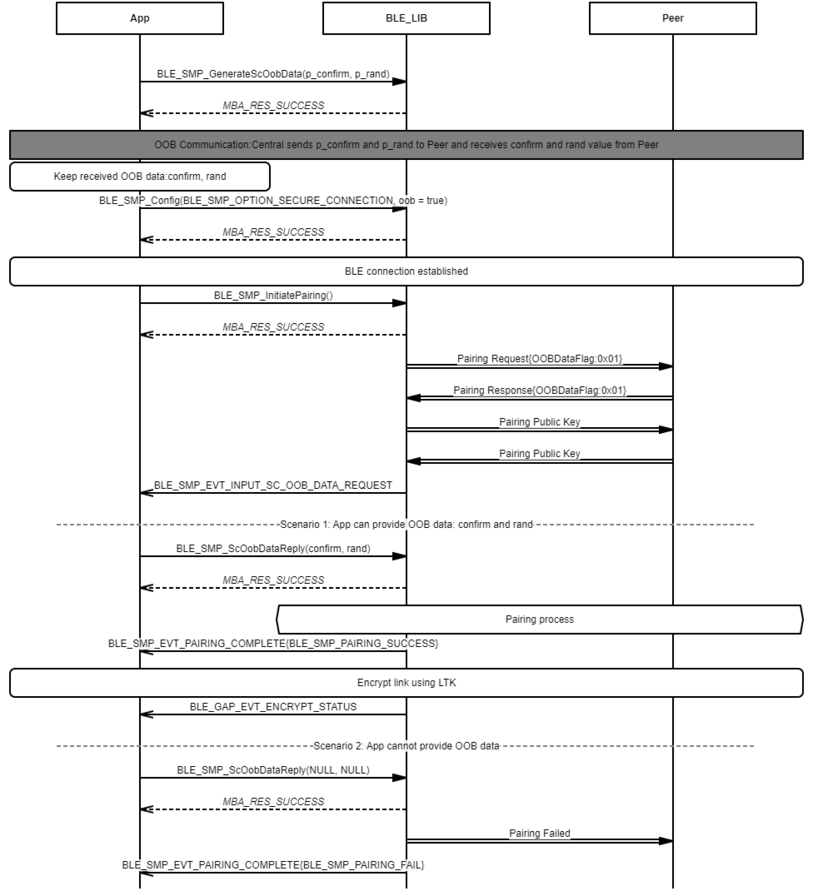

# SMP Central LESC Pairing Procedure

## Example of SMP Central LESC Pairing procedure - Just Works

 

 

## Example of SMP Central LESC Pairing procedure - Passkey Entry \(Central displays passkey\)

 

 

## Example of SMP Central LESC Pairing procedure - Passkey Entry \(Central inputs passkey\)

 

 

## Example of SMP Central LESC Pairing procedure - Numeric Comparison

 

 

## Example of SMP Central LESC Pairing procedure - OOB \(Only Central sends OOB data to Peer\)

 

 

## Example of SMP Central LESC Pairing procedure - OOB \(Only Peer sends OOB data to Central\)

 

 

## Example of SMP Central LESC Pairing procedure - OOB \(Central and Peer send OOB data to each other\)

 

 

**Parent topic:**[Message Sequence Chart](GUID-DDACB06B-D561-41CB-86EB-E457D3B3E020.md)

