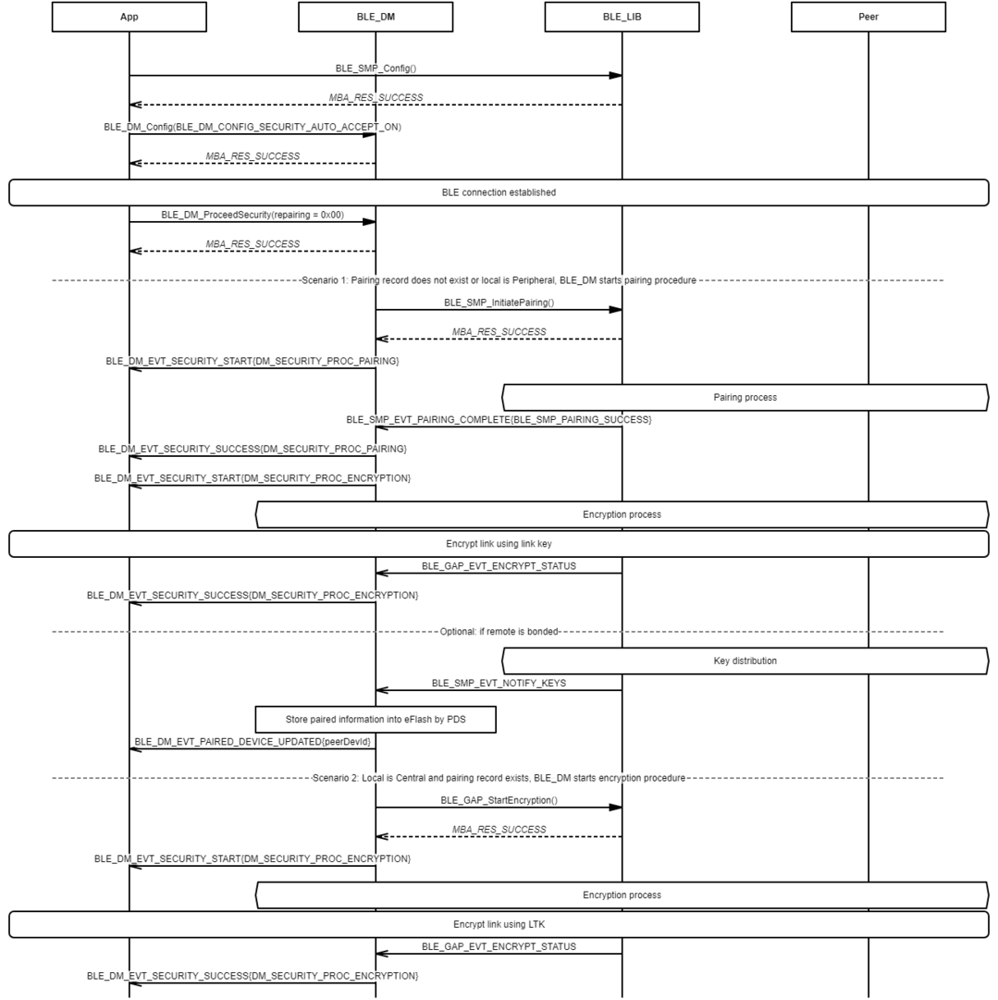
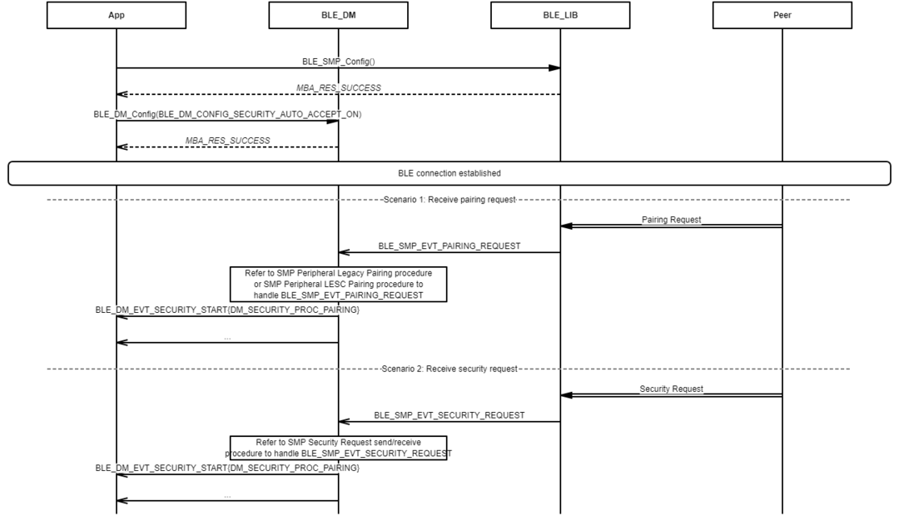
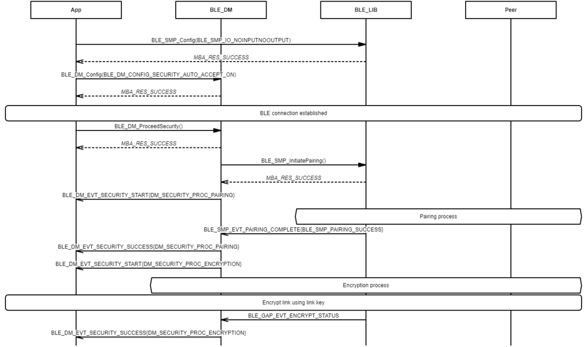
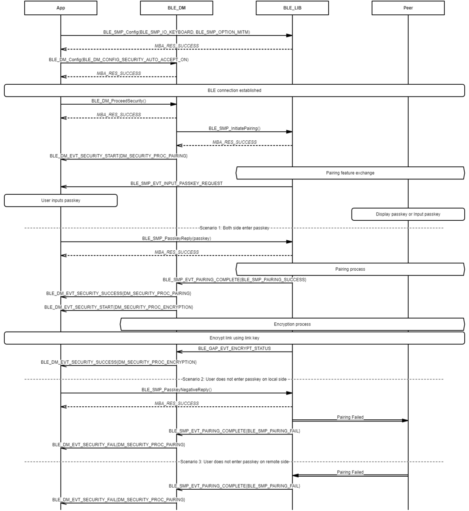
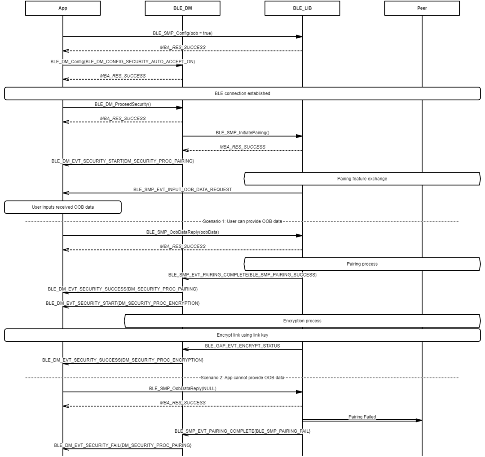
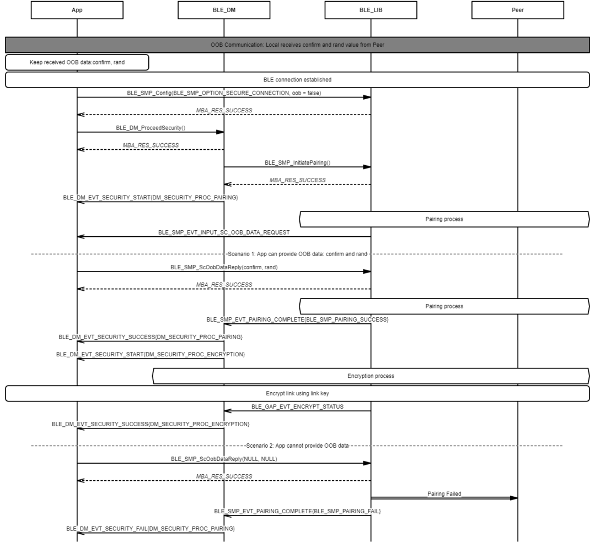

# Pairing procedure

## Example of security main flow

 

 

## Example of disabling accepts and responses pairing request and security request automatically

 

 

## Example of enabling accepts and responses pairing request and security request automatically

 

 

## Example of pairing procedure - Just Works

 

 

## Example of pairing procedure - Passkey Entry \(Local displays passkey\)

 

 

## Example of pairing procedure - Passkey Entry \(Local inputs passkey\)

 

 

## Example of pairing procedure - Numeric Comparison

 

 

## Example of pairing procedure - OOB \(Legacy pairing\)

 

 

## Example of pairing procedure - OOB \(LESC: Only Local sends OOB data to Peer\)

 

 

## Example of pairing procedure - OOB \(LESC: Only Peer sends OOB data to Local\)

 

 

## Example of pairing procedure - OOB \(LESC: Local and Peer send OOB data to each other\)

 

 

**Parent topic:**[Message Sequence Chart](GUID-8C579DB8-1E01-44BF-B3C9-1CB390F8A7BC.md)

