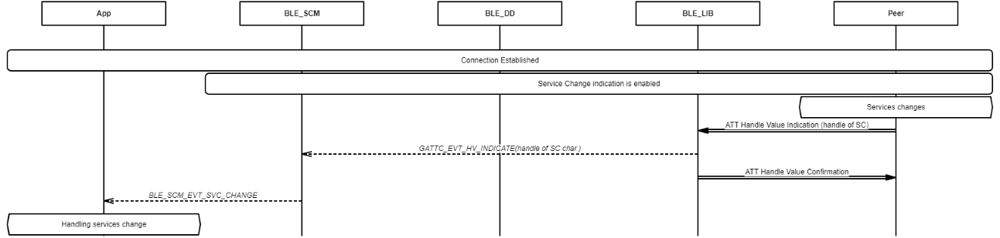
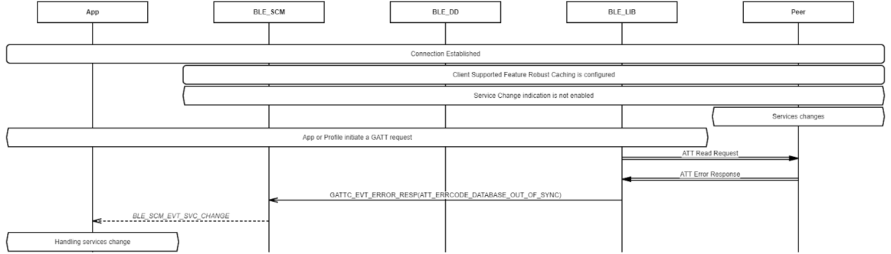

# Manage service change status at remote

 

-   Example of receiving service change indication from remote peer

 

-   Example of receiving Database out of sync. error code from remote peer

**Parent topic:**[Message Sequence Chart](GUID-7259983A-3268-4DAC-AB10-C7A606CD01E9.md)

