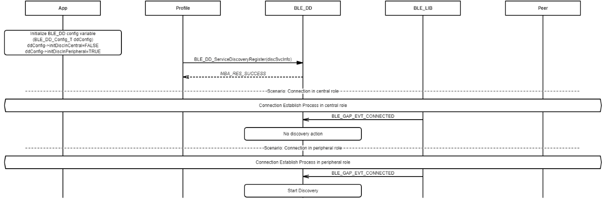

# Configure Database Discovery Function and Disable Discovery at Run Time

## Example of configuring database discovery function enabled in GAP central role

 

 

## Example of configuring database discovery function enabled in GAP peripheral role

 

 

## Example of disabling \(one time disable\) database discovery function at run time \(discovered results cached for paired connection\)

 

 

**Parent topic:**[Message Sequence Chart](GUID-7936CFC8-E8CB-4185-BFAA-2F49B1481F07.md)

