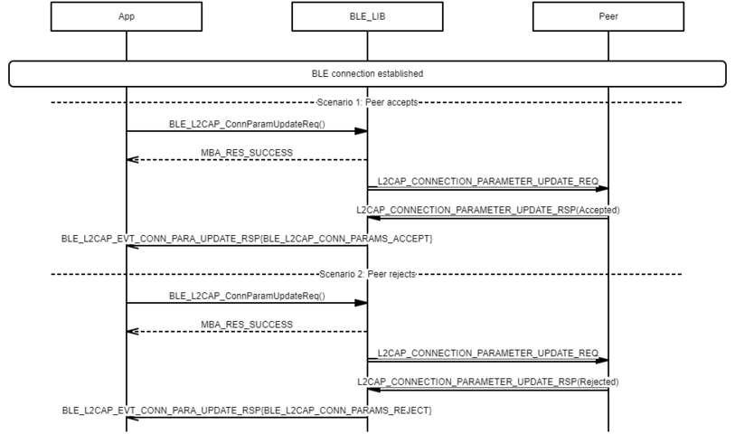
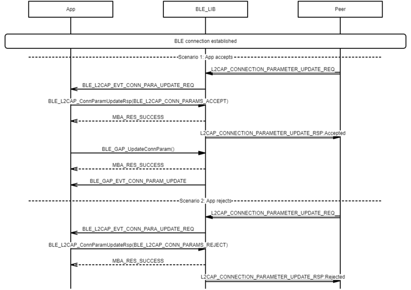

# L2CAP Connection Parameter Update procedure

## Example of L2CAP Connection Parameter Update procedure - Peripheral

 

 

## Example of L2CAP Connection Parameter Update procedure - Central

 

 

**Parent topic:**[Message Sequence Chart](GUID-00E43E29-22F6-4E44-B03F-CF14B8524B93.md)

