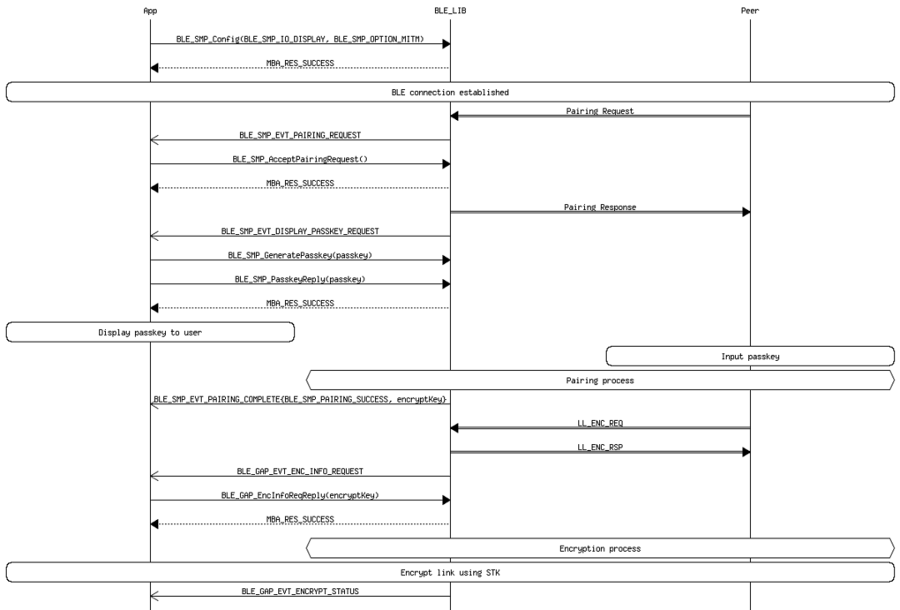
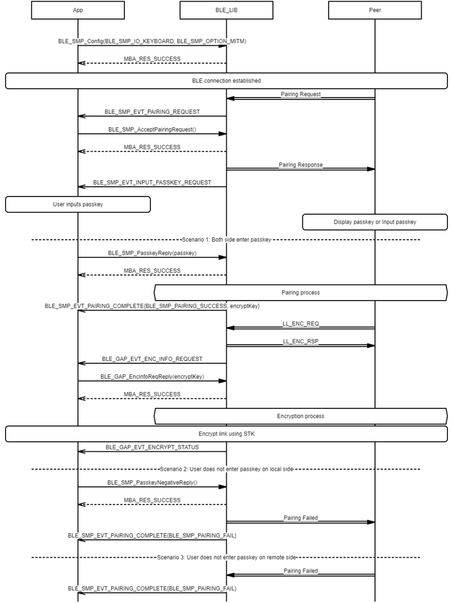

# SMP Peripheral Legacy Pairing procedure

## Example of SMP Peripheral Legacy Pairing procedure - Just Works

 

 

## Example of SMP Peripheral Legacy Pairing procedure - Passkey Entry \(Peripheral displays passkey\)

 

 

## Example of SMP Peripheral Legacy Pairing procedure - Passkey Entry \(Peripheral inputs passkey\)

 

 

## Example of SMP Peripheral Legacy Pairing procedure - Passkey Entry \(Peripheral inputs passkey\)

 

 

**Parent topic:**[Message Sequence Chart](GUID-DDACB06B-D561-41CB-86EB-E457D3B3E020.md)

