# GAP ADV / Ext ADV procedure

## Example of starting advertising

 

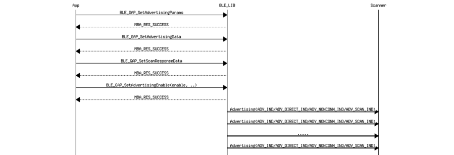

 

## Example of changing adv data under advertising enabled

 

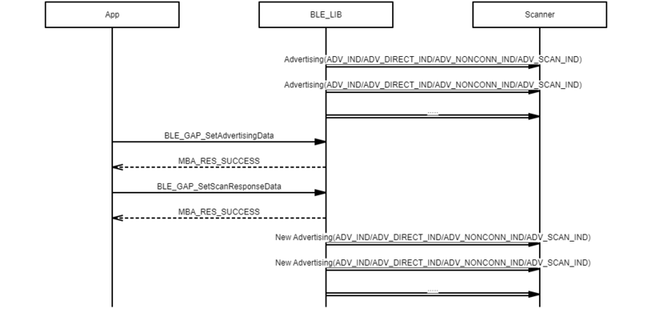

 

## Example of changing advertising parameter under advertising enabled

 

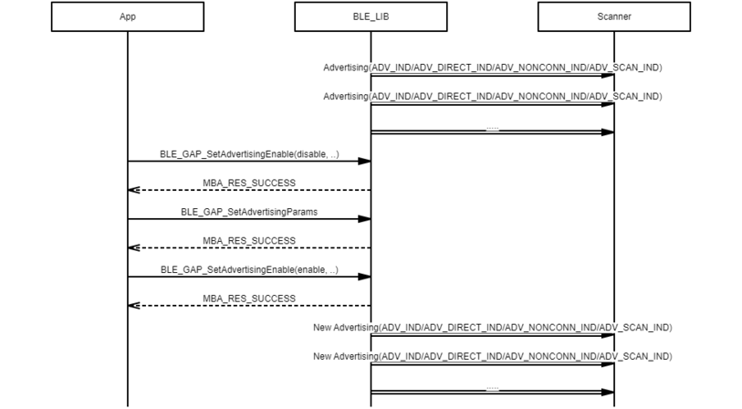

 

## Example of stopping advertising under advertising enabled

 

 

## Example of advertising timeout

 

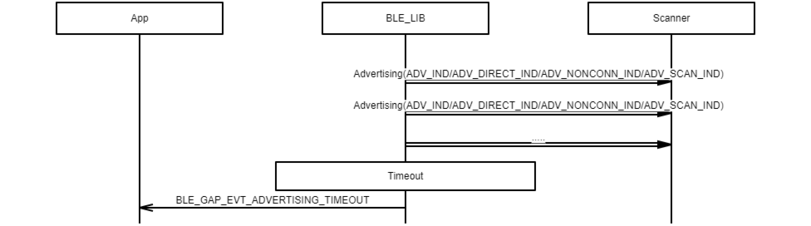

 

## Example of becoming peripheral role under advertising enabled

 

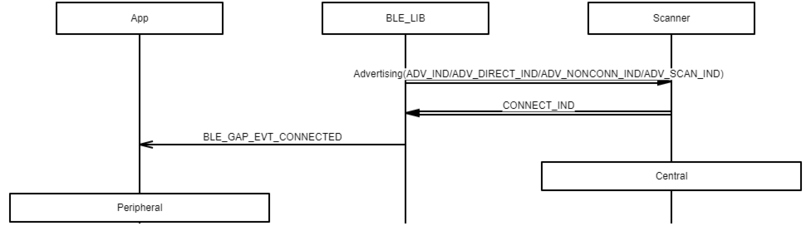

 

## Example of starting extended advertising

 

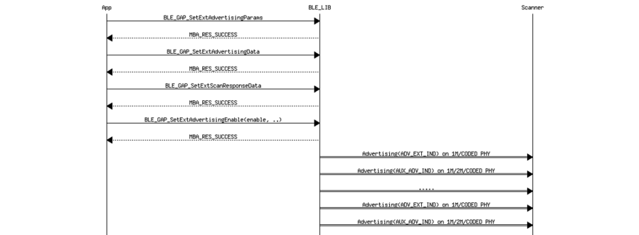

 

## Example of changing adv data under extended advertising enabled

 

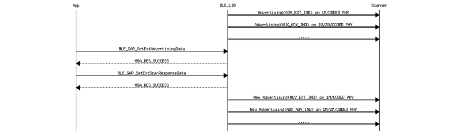

 

## Example of changing extended advertising parameter extended advertising enabled

 

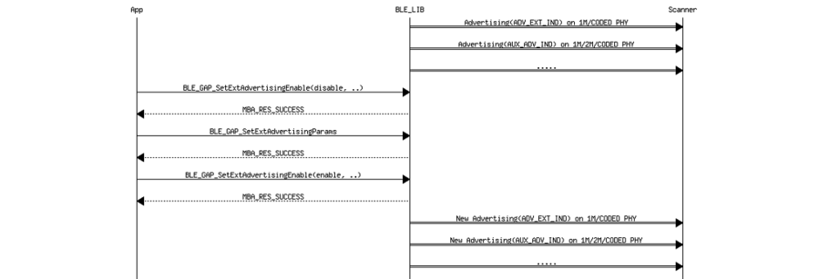

 

## Example of receiving BLE\_GAP\_EVT\_SCAN\_REQ\_RECEIVED event

 

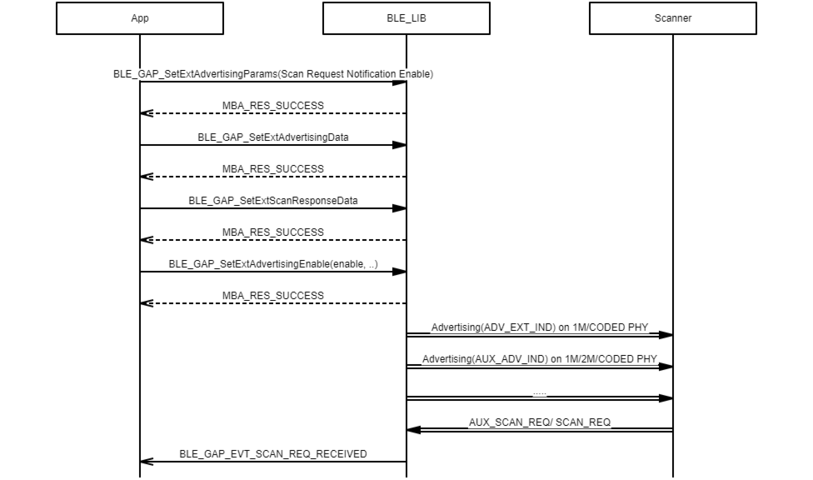

 

## Example of stopping extended advertising

 

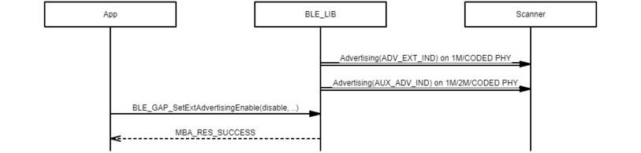

 

## Example of becoming peripheral role under extended advertising enabled

 

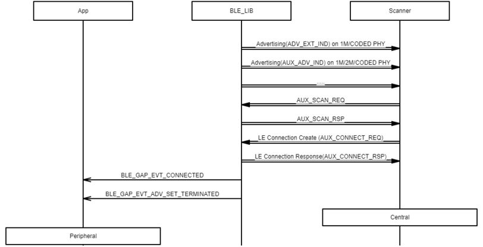

 

**Parent topic:**[Message Sequence Chart](GUID-1A7E8B4B-B471-43E1-BC73-81D705900D18.md)

