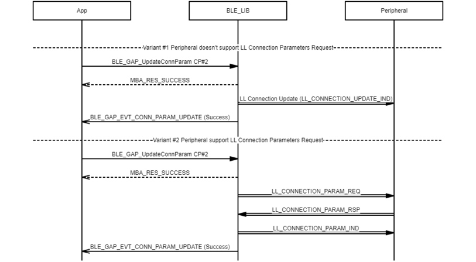
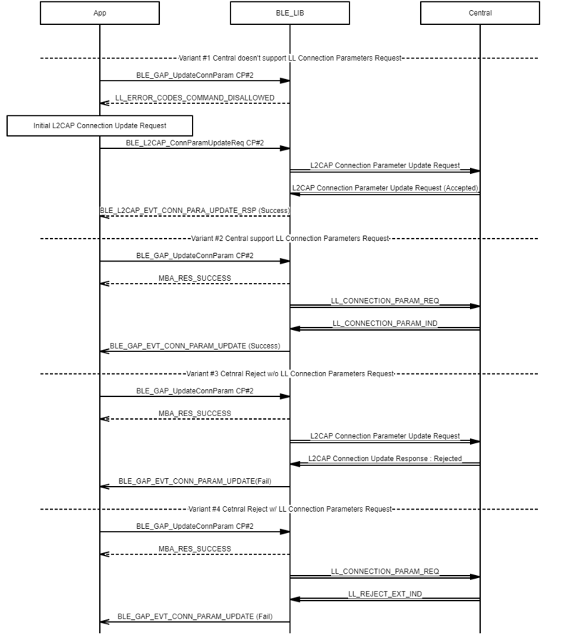

# GAP Update Connection Parameter procedure

 

-   Example of central updates connection parameter procedure

 

 

-   Example of peripheral updates connection parameter procedure

 

**Parent topic:**[Message Sequence Chart](GUID-30D405B5-0472-4B35-AD01-4DDF330F3091.md)

