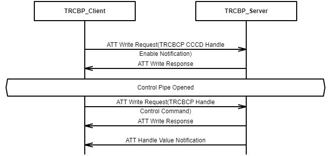

# Control Pipe

To enable the Control Pipe of Transparent Credit Based Profile, Client shall configure the  Transparent Credit Based Control Point \(TRCBCP\) characteristic for notifications \(i.e.,  via the *Client Characteristic Configuration Descriptor*\). Then Client can send the  control command to Server by writing a Characteristic Value to the TRCBCP  Characteristic. And Server can reply the control command to Client by performing a  Notification with a Characteristic Value to the TRCBCP Characteristic.

**Parent topic:**[Connection Establishment Procedures](GUID-BC52472F-FBF3-43EE-A491-FCEBA2CB0368.md)

