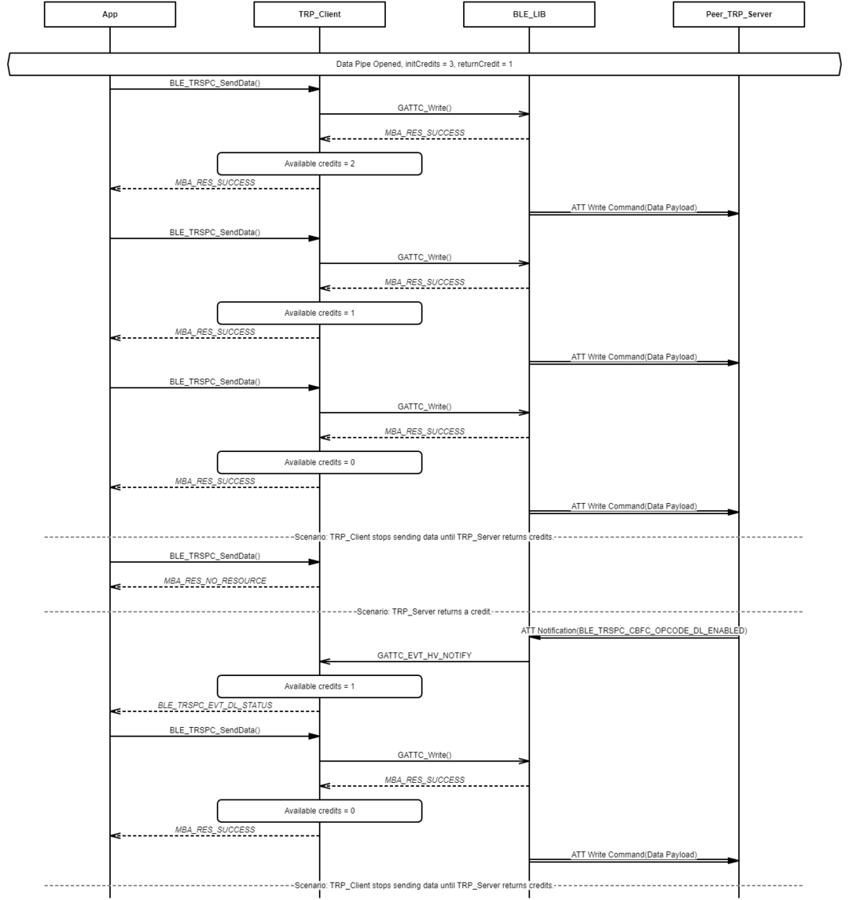
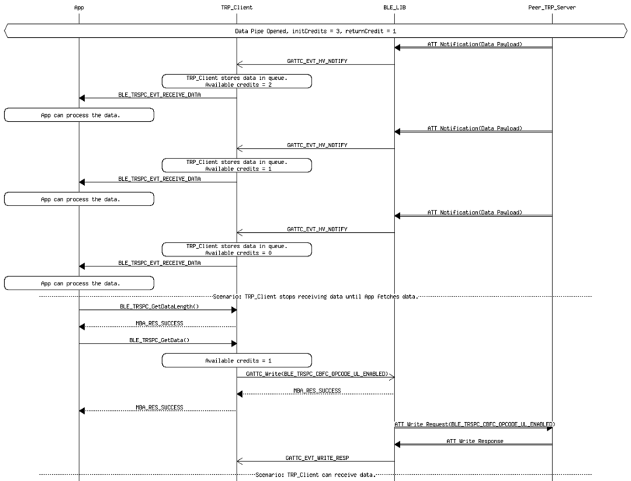

# Transparent Profile Data Exchange Procedure - Client Role

 

-   Example of Transparent Profile Client Role Data Exchange Over Data Pipe - The data is transmitted from a Client Role

 

 

-   Example of Transparent Profile Client Role Data Exchange Over Data Pipe - The data is transmitted from Server Role

 

**Parent topic:**[Message Sequence Chart](GUID-3D4E2E63-0227-40ED-BBB4-0E93622C38E0.md)

