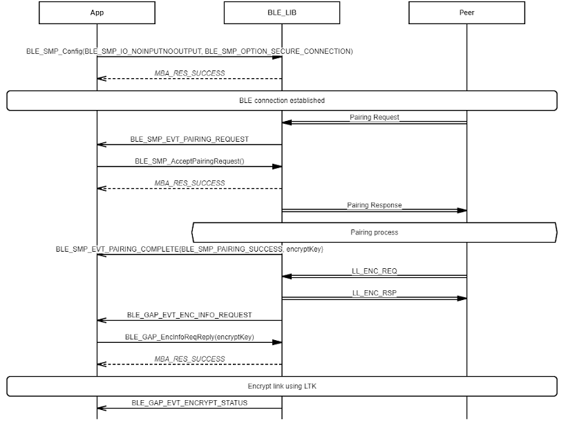
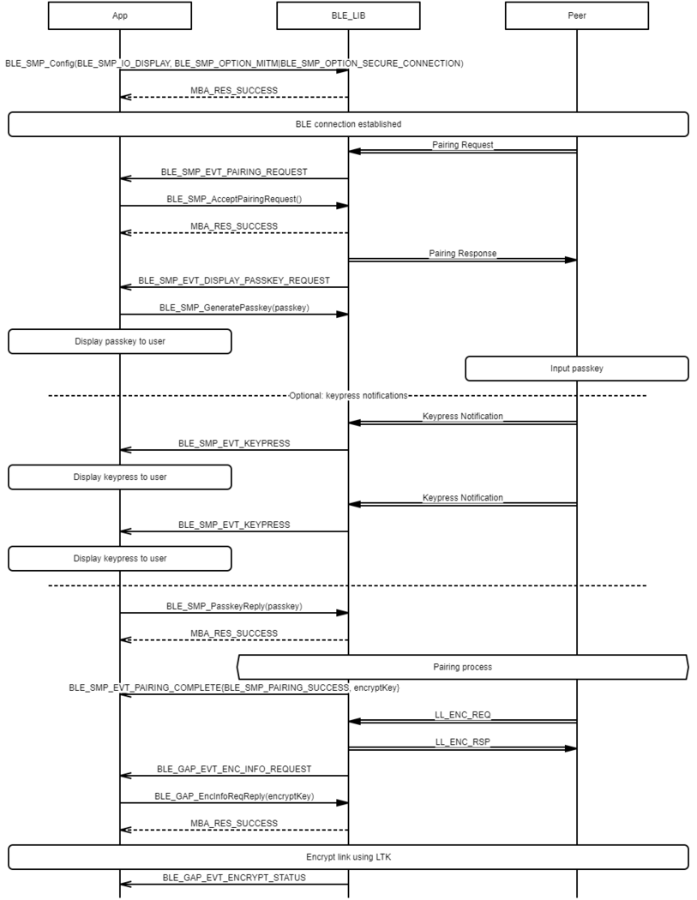

# SMP Peripheral LESC Pairing Procedure

## Example of SMP Peripheral LESC Pairing procedure - Just Works

 

 

## Example of SMP Peripheral LESC Pairing procedure - Passkey Entry \(Peripheral displays passkey\)

 

 

## Example of SMP Peripheral LESC Pairing procedure - Passkey Entry \(Both sides inputs passkey\)

 

 

## Example of SMP Peripheral LESC Pairing procedure - Passkey Entry \(User rejects to enter passkey on local side\)

 

 

## Example of SMP Peripheral LESC Pairing procedure - Passkey Entry \(Remote side rejects or doesn't entery passkey\)

 

 

## Example of SMP Peripheral LESC Pairing procedure - Numeric Comparison \(User confirms value is match on both sides\)

 

 

## Example of SMP Peripheral LESC Pairing procedure - Numeric Comparison \(User does not confirm value on local side\)

 

 

## Example of SMP Peripheral LESC Pairing procedure - Numeric Comparison \(User does not confirm value on remote side\)

 

 

## Example of SMP Peripheral LESC Pairing procedure - OOB \(Only Peripheral sends OOB data to Peer\)

 

 

## Example of SMP Peripheral LESC Pairing procedure - OOB \(Only Peer sends OOB data to Peripheral\)

 

 

## Example of SMP Peripheral LESC Pairing procedure - OOB \(Peripheral and Peer send OOB data to each other\)

 

 

**Parent topic:**[Message Sequence Chart](GUID-DDACB06B-D561-41CB-86EB-E457D3B3E020.md)

