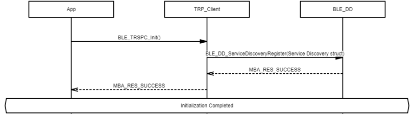
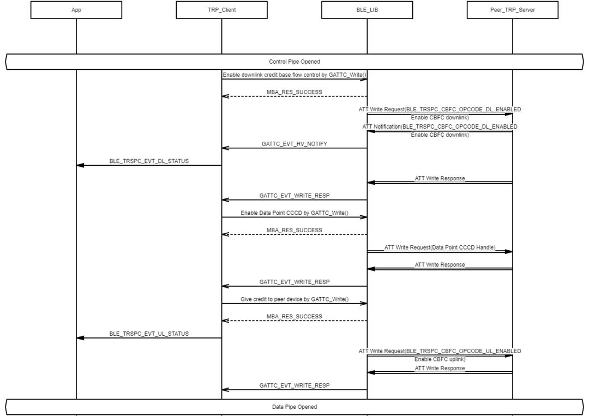

# Transparent Profile Client Role Initialization and Connection Establishment Procedure

## Example of Transparent Profile Client Role Initialization

 

 

## Example of Opening Transparent Profile Client Role Control Pipe

 

 

## Example of Opening Transparent Profile Client Role Data Pipe

 

 

**Parent topic:**[Message Sequence Chart](GUID-3D4E2E63-0227-40ED-BBB4-0E93622C38E0.md)

