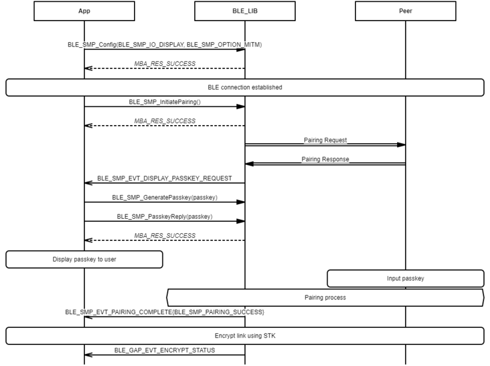
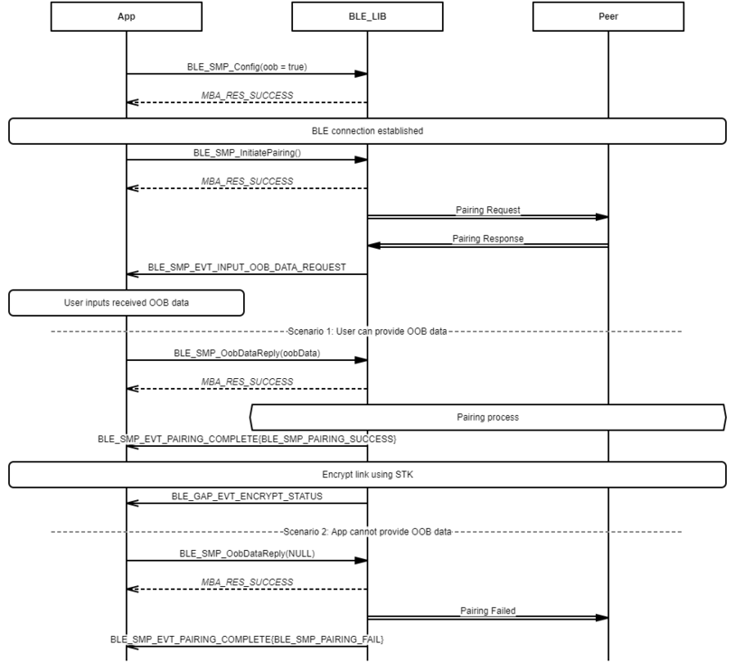

# SMP Central Legacy Pairing Procedure

 

-   Example of SMP Central Legacy Pairing procedure - Just Works

 

 

-   Example of SMP Central Legacy Pairing procedure - Passkey Entry \(Central displays passkey\)

 

 

-   Example of SMP Central Legacy Pairing procedure - Passkey Entry \(Central inputs passkey\)

 

 

-   Example of SMP Central Legacy Pairing procedure - OOB

 

**Parent topic:**[Message Sequence Chart](GUID-D0C13598-2B10-4D13-B20A-8FE097B7D2FC.md)

