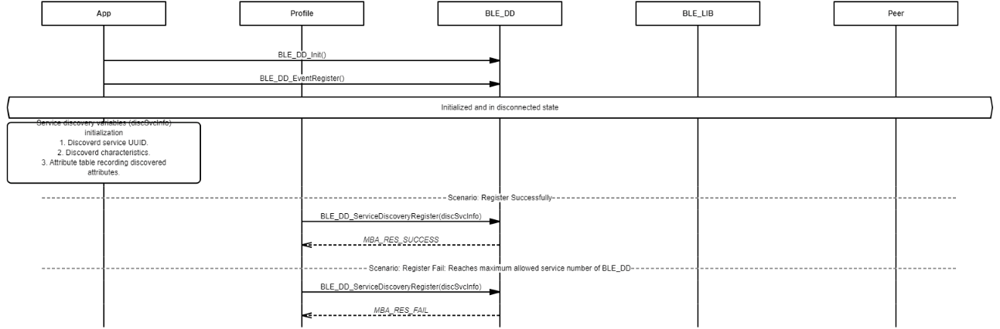

# Register Discover Service Information For Discovery

 

-   Example of initializing and registering discovered service to BLE\_DD module

 

**Parent topic:**[Message Sequence Chart](GUID-92488830-E17D-4AA1-9A3C-BEC23C905D64.md)

