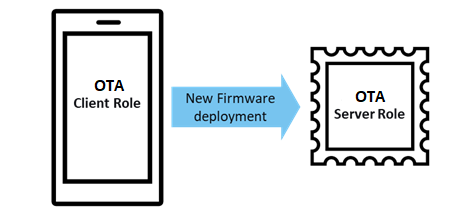

# Roles

The profile defines two roles: OTA Client and OTA Server. In general, mobile phone plays as OTA  Client role and BLE accessory device is Server device.

**Parent topic:**[Configuration](GUID-5FBAF639-F6DA-4A3C-BCC1-70EAC76AA65F.md)

