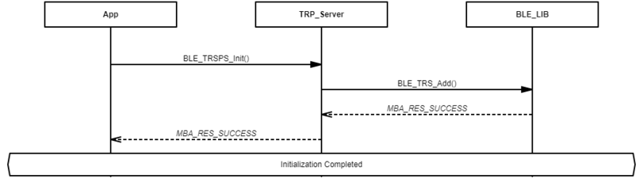
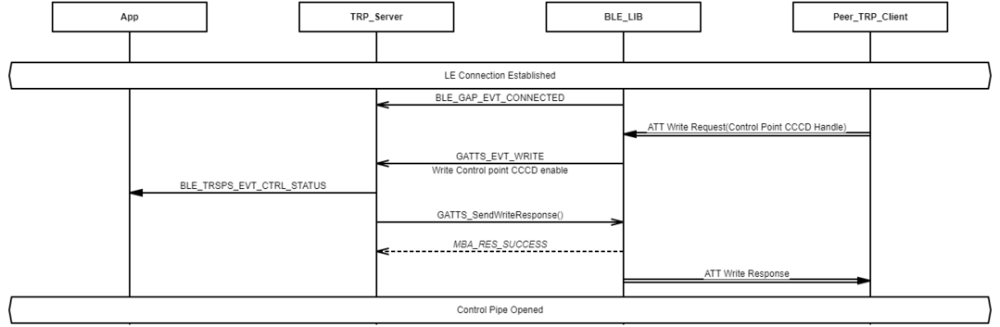
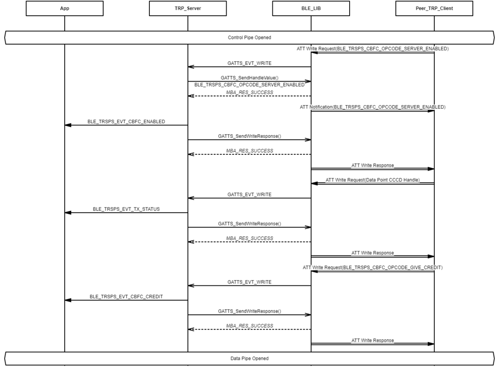

# Transparent Profile Server Role Initialization and Connection Establishment Procedure

## Example of Transparent Profile Server Role Initialization

 

 

## Example of Opening Transparent Profile Server Role Control Pipe

 

 

## Example of Opening Transparent Profile Server Role Data Pip

 

 

**Parent topic:**[TRSP Message Sequence Chart](GUID-ABC8747A-F11E-4932-BED6-4E402D92C436.md)

