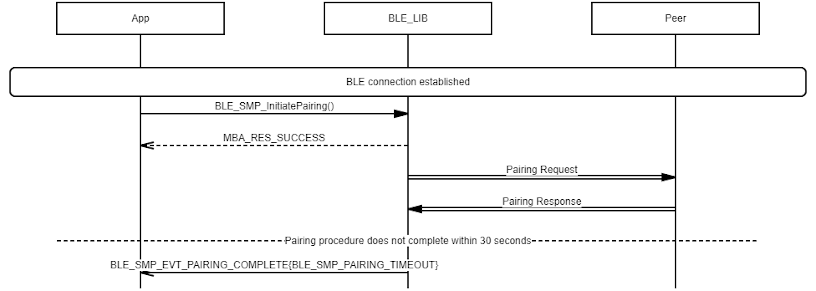
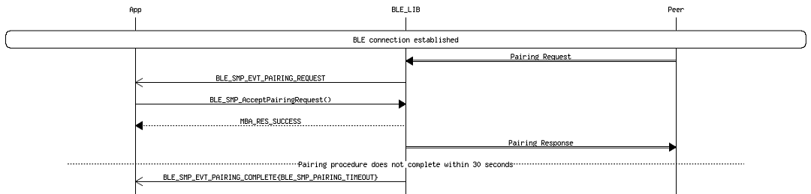

# SMP Pairing Timeout Procedure

## Example of SMP Central Pairing Timeout

 

 

## Example of SMP Peripheral Pairing Timeout

 

 

**Parent topic:**[Message Sequence Chart](GUID-DDACB06B-D561-41CB-86EB-E457D3B3E020.md)

