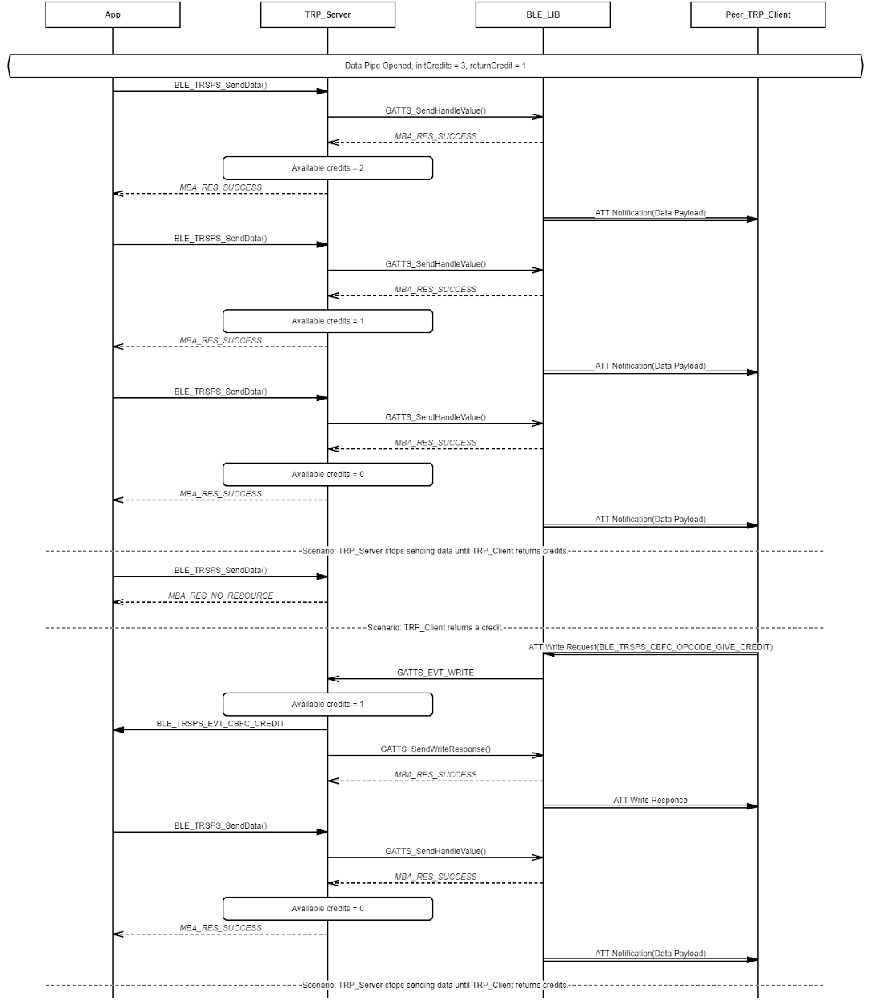
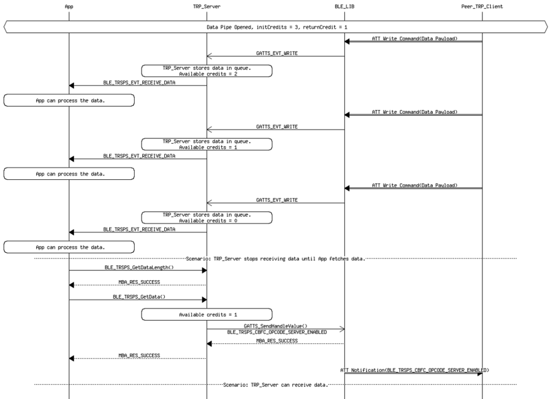

# Transparent Profile Data Exchange Procedure - Server Role

## Example of Transparent Profile Server Role Data Exchange Over Data Pipe - The data is transmitted from a Server Role

 

 

## Example of Transparent Profile Server Role Data Exchange Over Data Pipe - The data is transmitted from Client Role

 

 

**Parent topic:**[TRSP Message Sequence Chart](GUID-ABC8747A-F11E-4932-BED6-4E402D92C436.md)

