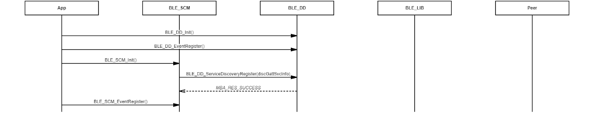

# Initialize Service Change Manager module

 

-   Example of initializing \(BLE\_DD module is required for BLE\_SCM\). Managing service change status after connection established

 

**Parent topic:**[Message Sequence Chart](GUID-7259983A-3268-4DAC-AB10-C7A606CD01E9.md)

