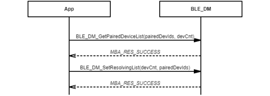

# Resolving list process

## Example of setting all paired devices to resolving list

 

 

## Example of setting partial paired devices to resolving list

 

 

**Parent topic:**[Message Sequence Chart](GUID-8C579DB8-1E01-44BF-B3C9-1CB390F8A7BC.md)

