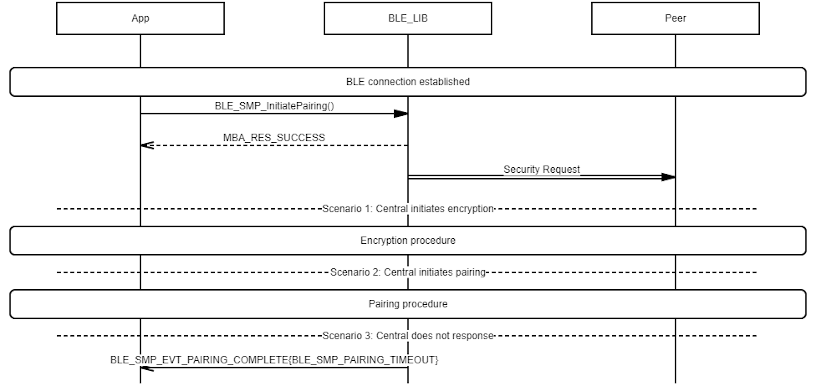

# SMP Security Request Send/Receive Procedure

## Example of SMP Central Receives Security Request

 

 

## Example of SMP Peripheral Sends Security Request

 

 

**Parent topic:**[Message Sequence Chart](GUID-DDACB06B-D561-41CB-86EB-E457D3B3E020.md)

