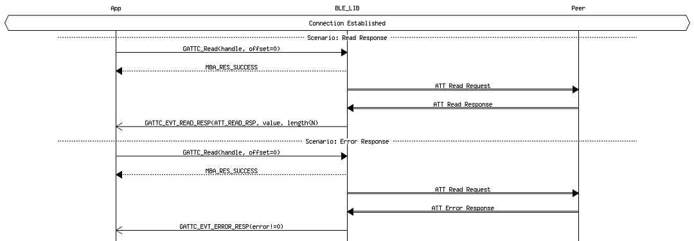

# GATTC Characteristic/Characteristic Descriptor Value Read

## Example of GATTC Characteristic/Characteristic Descriptor Value Read \(N=ATT\_MTU-1\)

 

 

**Parent topic:**[Message Sequence Chart](GUID-4E6414B1-49B8-427C-ACFB-97EF00444F24.md)

