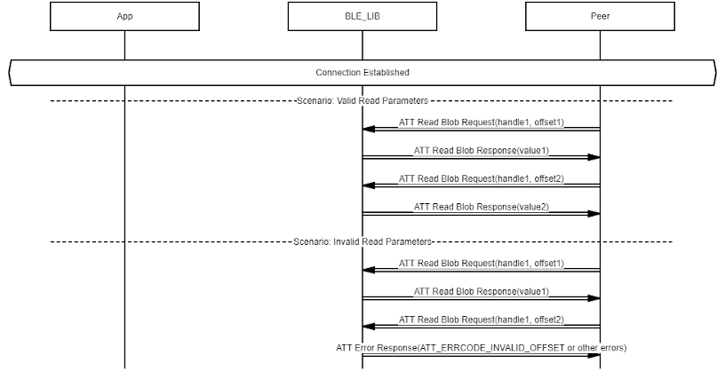
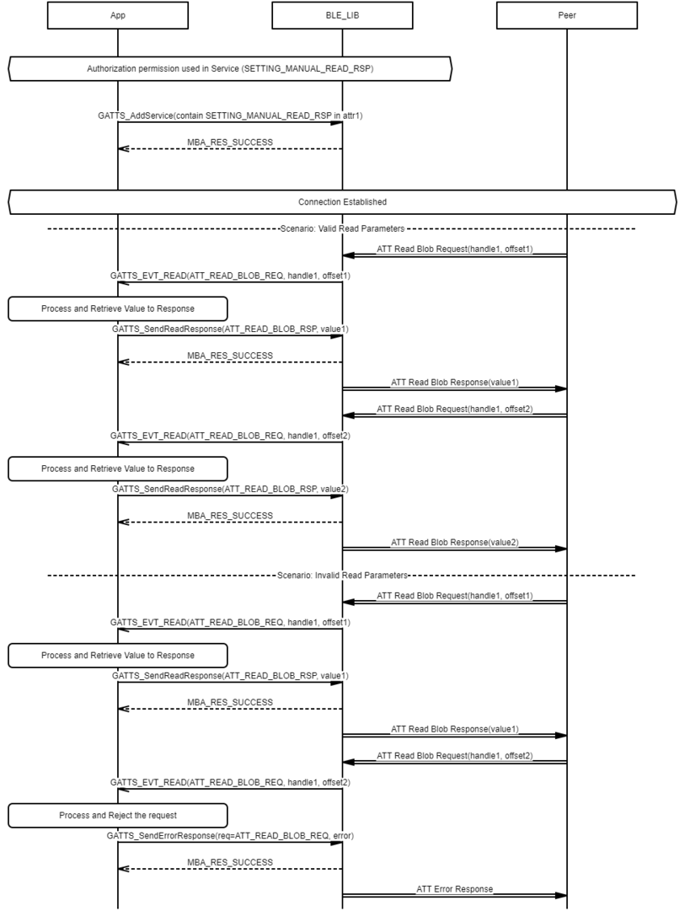

# GATTS Long Characteristic/Characteristic Descriptor Value Read

## Example of GATTS Characteristic/Characteristic Descriptor Value Long Read \(Handled by BLE\_LIB\)

 

 

## Example of GATTS Characteristic/Characteristic Descriptor Value Long Read \(Handled by Application\). Authorization permission case. The permission is accomplished by setting SETTING\_MANUAL\_READ\_RSP on the attribute

 

 

**Parent topic:**[Message Sequence Chart](GUID-F222E22D-493E-4F16-8480-6F7AAD168EB9.md)

