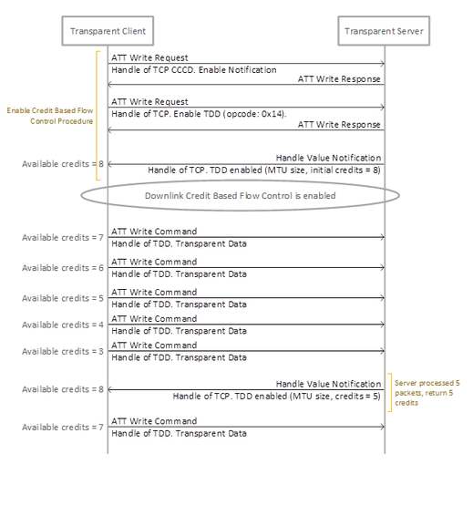

# Downlink Credit Based Flow Control \(DCBFC\)

The procedure is used by a Transparent Client to enable Downlink Credit Based Flow  Control for the Transparent Server. Once it is enabled, Client role can only send data  to Server while the credit count is greater than zero.

When enabling Downlink Credit Based Flow Control, Client shall write TCP characteristic  handle with “Downlink Credit Based Flow Control Enable� opcode \(0x14\) to the Transparent  Control Point on Transparent Server. And the Transparent Server shall send the MTU value  and available credit numbers to Transparent Client by Response Parameters of 0x00  opcode. Transparent Client will check the credit count to know how many data can be  transmitted to the Transparent Server by performing the write command operation to TDD  Characteristic handle. The Credit count will be decreased by the number of ATT packet  sending by Transparent Client. Transparent Client can send data only while the credit  count is greater than zero. Transparent Server shall return the credit to Transparent  Client after the received data has been processed completed.

**Parent topic:**[Transparent Control Point Characteristic Behavior](GUID-7A2BC74D-E714-41F0-8201-0D183867E570.md)

