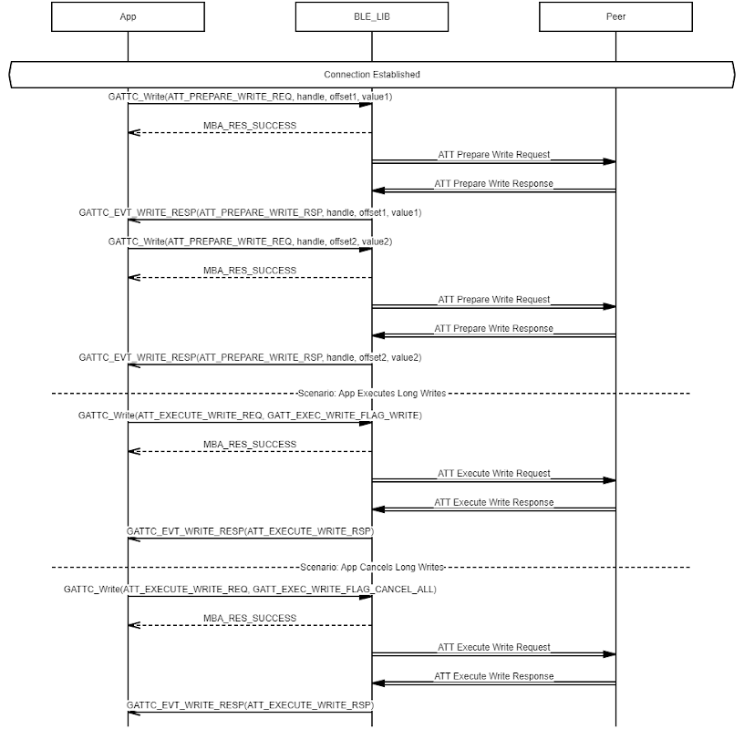

# GATTC Long Characteristic/Characteristic Descriptor Value Write

 

-   Example of GATTC Long Characteristic/Characteristic Descriptor Value Write

 

**Parent topic:**[Message Sequence Chart](GUID-F222E22D-493E-4F16-8480-6F7AAD168EB9.md)

