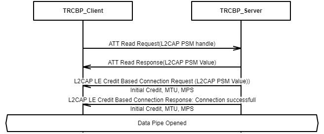

# Data Pipe

Before creating the L2CAP CoC connection, Client obtains the L2CAP PSM value for the TRCBP Data  Pipe by reading the L2PSM characteristic from Server role. Then Client issues the L2CAP  CoC connection request with LE Credit Based Flow Control Mode based on the L2CAP PSM  value.

Figure 5.1 illustrates the example of opening Transparent Credit Based Profile Data Pipe.

**Parent topic:**[Connection Establishment Procedures](GUID-BC52472F-FBF3-43EE-A491-FCEBA2CB0368.md)

