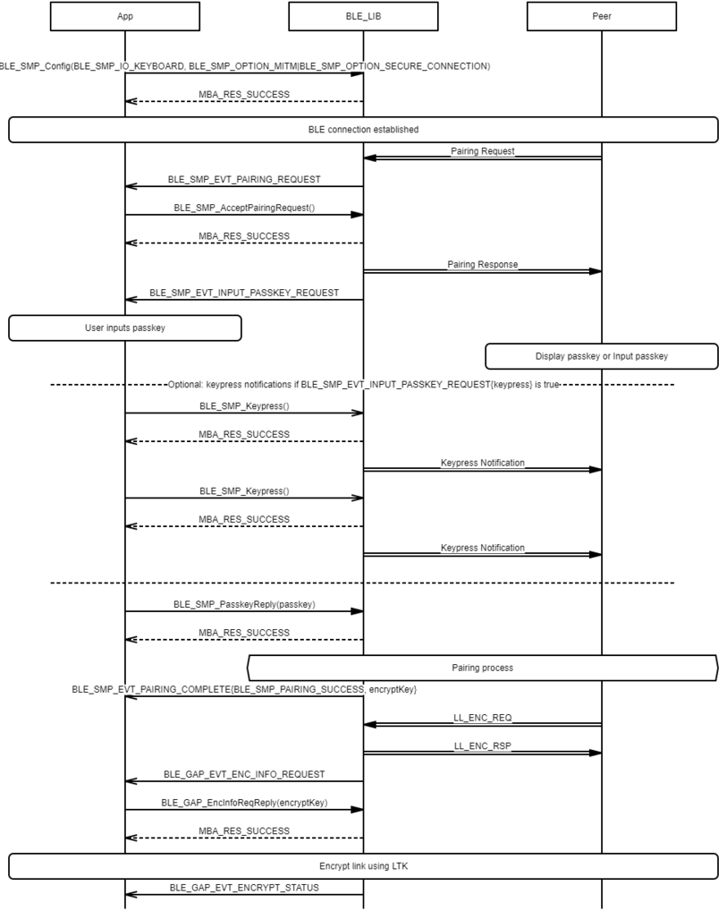
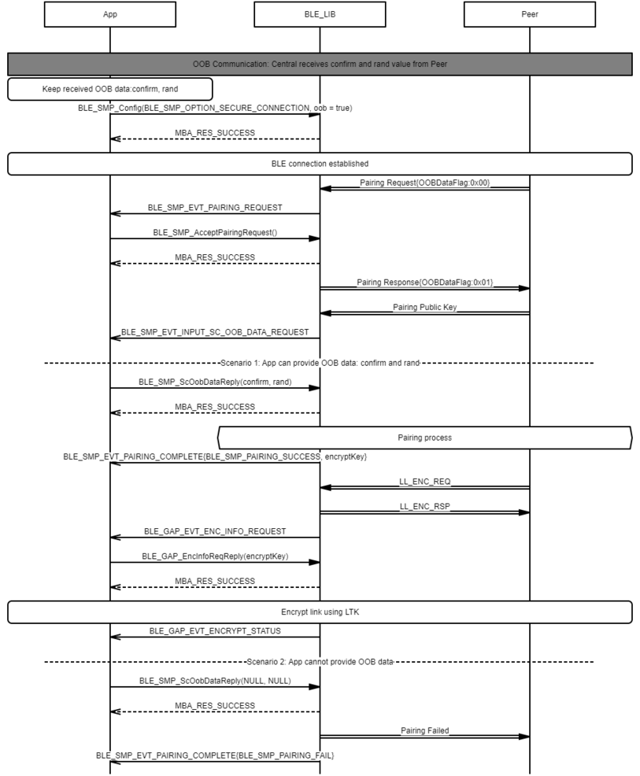

# SMP Peripheral LESC Pairing Procedure

 

-   Example of SMP Peripheral LESC Pairing procedure - Just Works

 

 

-   Example of SMP Peripheral LESC Pairing procedure - Passkey Entry \(Peripheral displays passkey\)

 

 

-   Example of SMP Peripheral LESC Pairing procedure - Passkey Entry \(Peripheral inputs passkey\)

 

 

-   Example of SMP Peripheral LESC Pairing procedure - Numeric Comparison

 

 

-   Example of SMP Peripheral LESC Pairing procedure - OOB \(Only Peripheral sends  OOB data to Peer\)

 

 

-   Example of SMP Peripheral LESC Pairing procedure - OOB \(Only Peer sends OOB data to Peripheral\)

 

 

-   Example of SMP Peripheral LESC Pairing procedure - OOB \(Only Peer sends OOB data to Peripheral\)

 

**Parent topic:**[Message Sequence Chart](GUID-D0C13598-2B10-4D13-B20A-8FE097B7D2FC.md)

