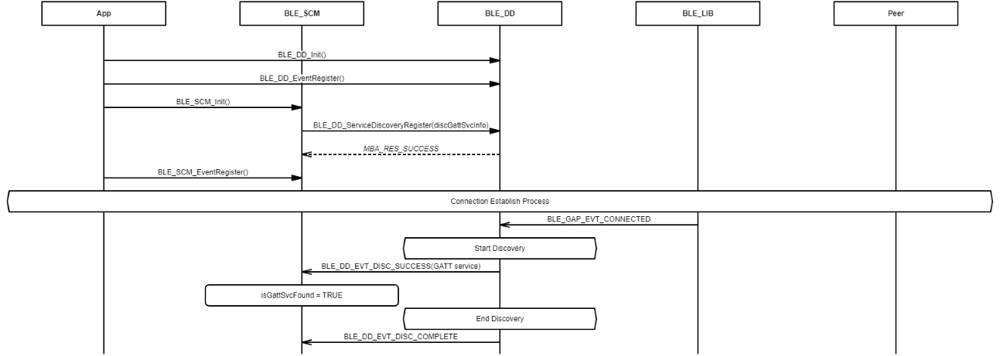
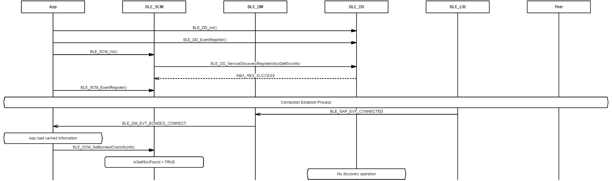

# Get characteristic handles of remote GATT service

## Example of getting characteristic handles from database discovery

 

 

## Example of getting characteristic handles from application \(connection paired and handles cached\)

 

 

**Parent topic:**[Message Sequence Chart](GUID-7259983A-3268-4DAC-AB10-C7A606CD01E9.md)

