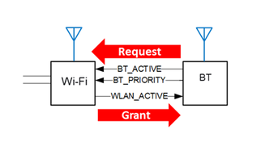

# BLE PTA Introduction

PIC32CXBZ2 provides the Three-Wire Packet Traffic Arbitration \(PTA\) WLAN coexistence  solution. This coexistence solution contains three pins that exchange coordinating  information between BT and WLAN. When a BT request \(BT\_ACTIVE=1\) is received, the Wi-Fi device  compares this external priority \(BT\_PRIORITY\) request against the internal Wi-Fi priority, and  can choose to either grant BT \(WLAN\_ACTIVE=0\) or Wi-Fi \(WLAN\_ACTIVE=1\)

-   **BT\_ACTIVE**: This output pin describes when BT is using the RF resources. When the signal on it is high, it means BT is asking and accessing the RF; when the signal is low, BT is not using the RF.
-   **BT\_PRIORITY**: Comparing with **Time-shared** design, PIC32CXBZ2 is designed as **Static** output signal describes the priority of the BT request. When the signal on it is high, it represents a high-priority BT request; otherwise, it is a low-priority request. See Appendix 1 for both **Static**and **Time-shared** design concepts.
-   **WLAN\_ACTIVE**: This input pin brings in the information about when the WLAN activities are taking place. When the signal is high, it means a WLAN activity is using the RF resources; when the signal is low, WLAN is not using the RF.

**Parent topic:**[BLE PTA](GUID-C76FA981-3CAC-4973-AE4F-8FFEE405F570.md)

