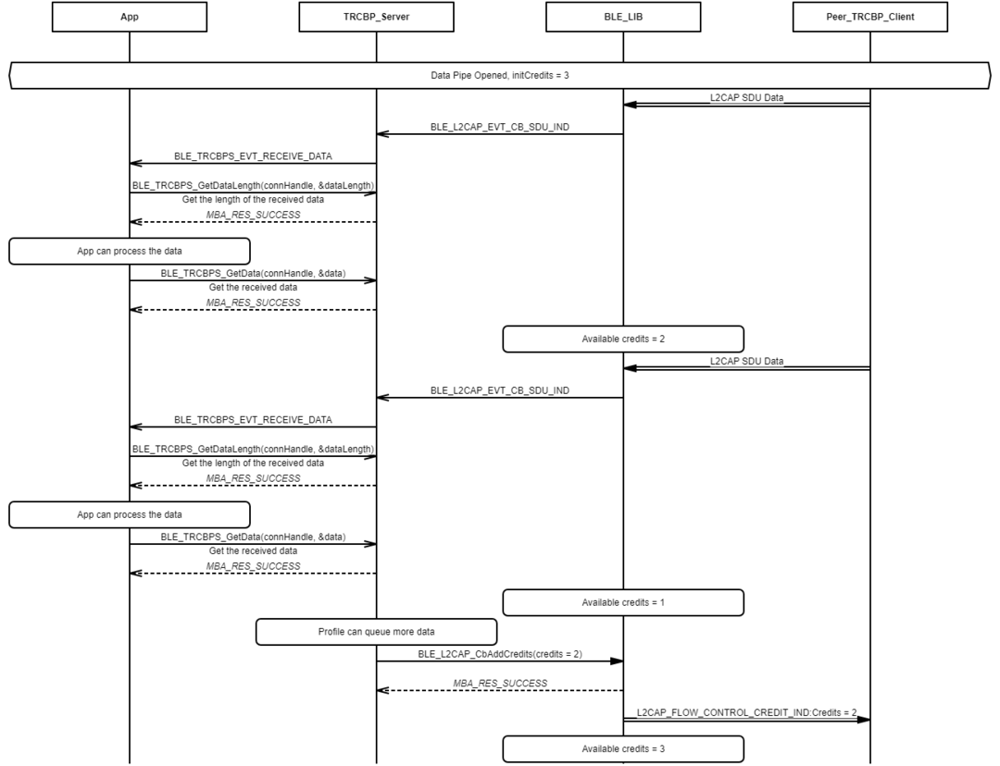
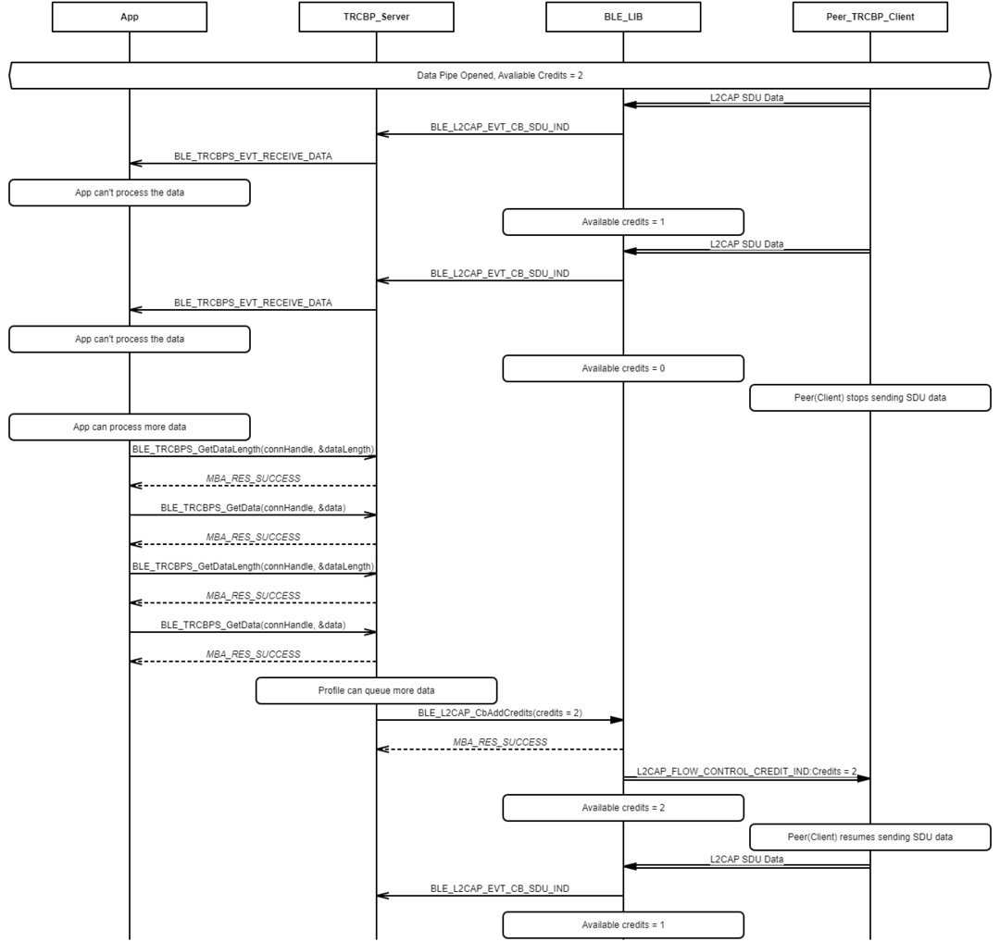
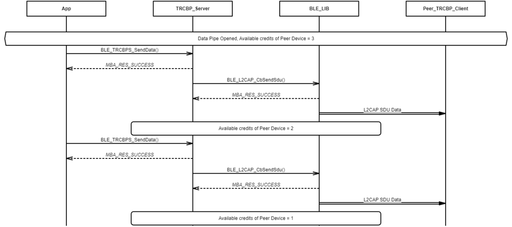
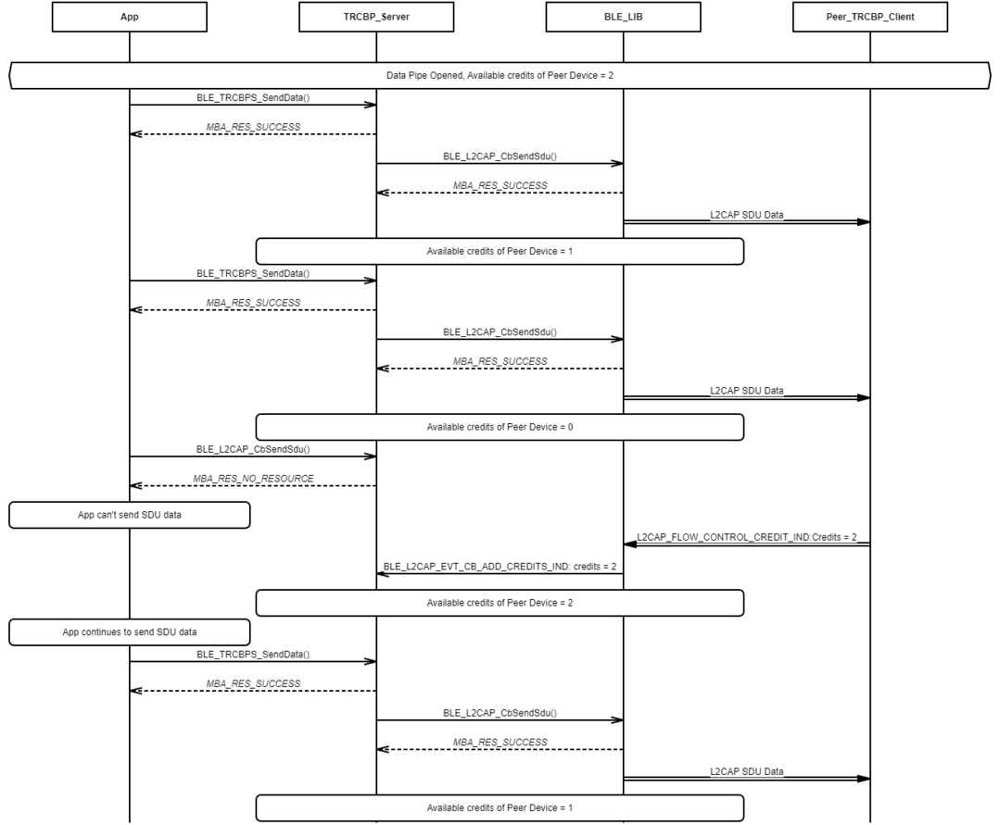
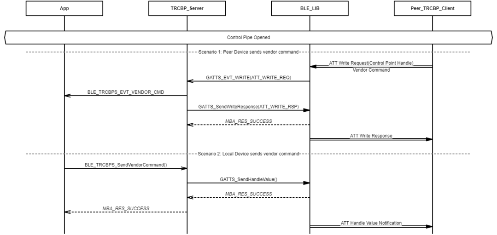

# Transparent Credit Based Profile Data/Vendor Command Exchange Procedure

## Example of Transparent Credit Based Profile Data Exchange \(Client to Server\) Over Data Pipe

 

 

## Example of Transparent Credit Based Profile Vendor Command Exchange Over Control Pipe

 

 

## Example of Transparent Credit Based Profile Data Exchange \(Server to Client\) Over Data Pipe

 

 

## Example of Transparent Credit Based Profile Data Exchange \(Server to Client\) Over Data Pipe without available credits

 

 

## Example of Transparent Credit Based Profile Vendor Command Exchange Over Control Pipe

 

 

**Parent topic:**[TRCBP Message Sequence Chart](GUID-338BED4B-6274-4CF7-A108-1651CE421817.md)

