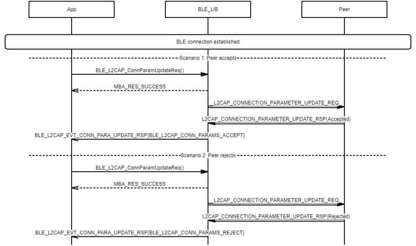
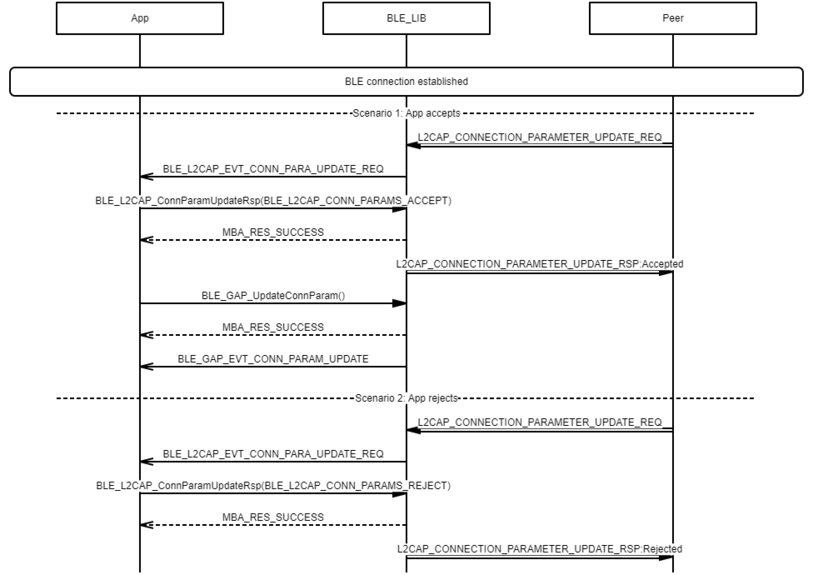

# L2CAP Connection Parameter Update procedure

 

-   Example of L2CAP Connection Parameter Update procedure - Peripheral

 

 

-   Example of L2CAP Connection Parameter Update procedure - Central

 

**Parent topic:**[Message Sequence Chart](GUID-E43CD7B5-B5AE-4019-A8AB-501B2100EB2E.md)

