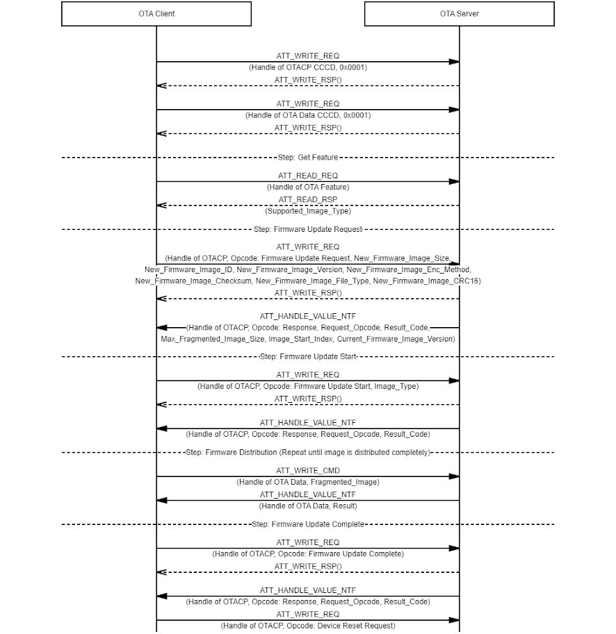

# OTA Firmware Update Procedures

The generic procedures defined in this section provide standardized methods of using the features  of the OTA Service [\[1\]](GUID-6B274602-B628-48D8-9345-D483824E66AC.md) in specified sequences in order to satisfy common use cases. This  profile does not forbid the use of the features of OTAS in other ways and a higher layer  profile may define such additional procedures. However, wherever a procedure listed in  [Table 4.4](GUID-EC76D2B4-D7A9-430C-A3AE-AFE5B8D1BC3F.md) is supported, the implementation of the procedure shall conform to the  requirements of this profile specification.

The following diagram shows the message sequence chart of OTA firmware update  process.

-   **[OTA Feature Discovery](GUID-67E481F5-EA68-4C6C-AAA3-AE4B41EB52C1.md)**  

-   **[OTA Data Discovery](GUID-59329C67-A345-4700-8FE4-BAF20D3B4EBB.md)**  

-   **[Firmware Update Request Operation](GUID-54C7E990-94F7-40DD-BD1F-A5628B538B05.md)**  

-   **[Firmware Update Start Operation](GUID-0CDC457D-EAA3-48B9-AC02-2BEA92E23B79.md)**  

-   **[Firmware Update Complete Operation](GUID-3C858497-5BAC-4608-94D4-F56EA856A20B.md)**  

-   **[Device Reset Request Operation](GUID-37DD486E-D5DB-4306-9BFE-7AB8E35EB7C6.md)**  

**Parent topic:**[OTA Client Role Requirements](GUID-B2F97739-5023-45D6-9D0C-B935040A232B.md)

