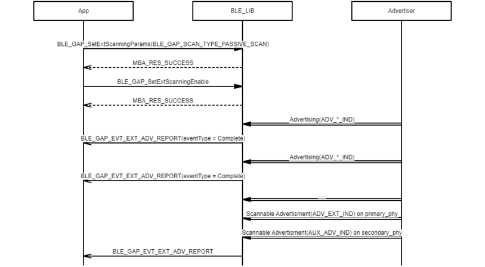
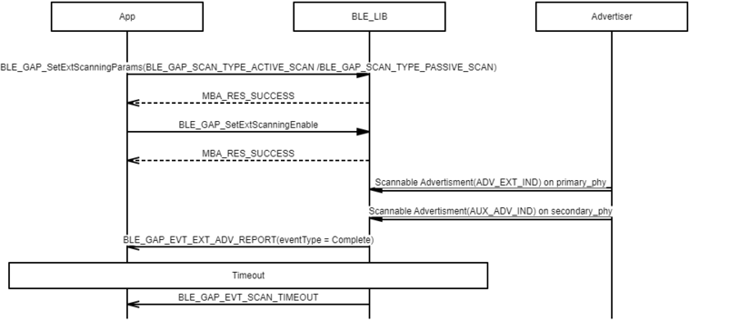

# GAP SCAN / Ext SCAN procedure

## Example of starting active scan

 

 

## Example of starting passive scan

 

 

## Example of receiving ADV\_DIRECT\_IND

 

 

## Example of scan timeout

 

 

## Example of starting extended active scan

 

 

## Example of starting extended passive scan

 

 

## Example of receiving incomplete advertising report

 

 

## Example of losing partial of sequential advertising report

 

 

## Example of extended scan timeout

 

 

**Parent topic:**[Message Sequence Chart](GUID-1A7E8B4B-B471-43E1-BC73-81D705900D18.md)

