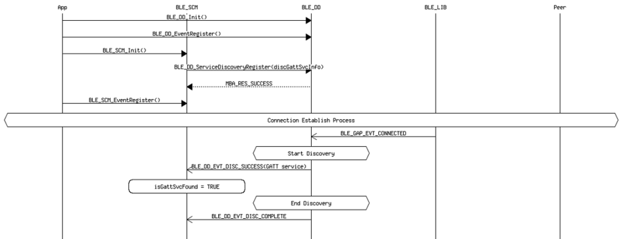

# Get characteristic handles of remote GATT service

## Example of getting characteristic handles from database discovery

 

 

## Example of getting characteristic handles from application \(connection paired and handles cached\)

 

 

**Parent topic:**[Massage Sequence Chart](GUID-BD256D1E-A211-4A51-9B0B-E12B1C72E342.md)

