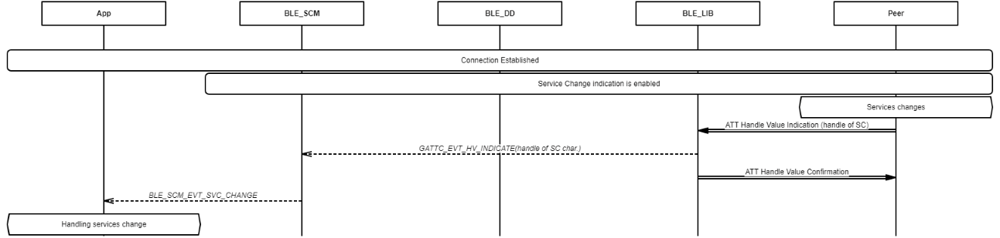
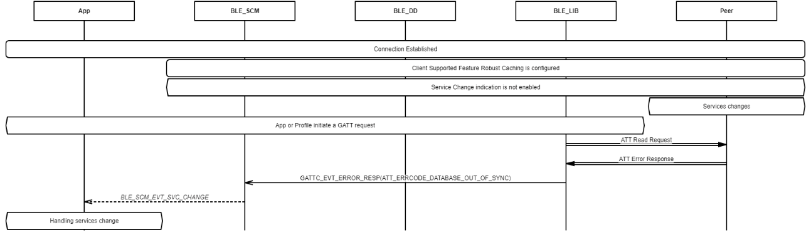

# Manage service change status at remote

## Example of receiving service change indication from remote peer

 

 

## Example of receiving Database out of sync. error code from remote peer

 

 

**Parent topic:**[Massage Sequence Chart](GUID-BD256D1E-A211-4A51-9B0B-E12B1C72E342.md)

