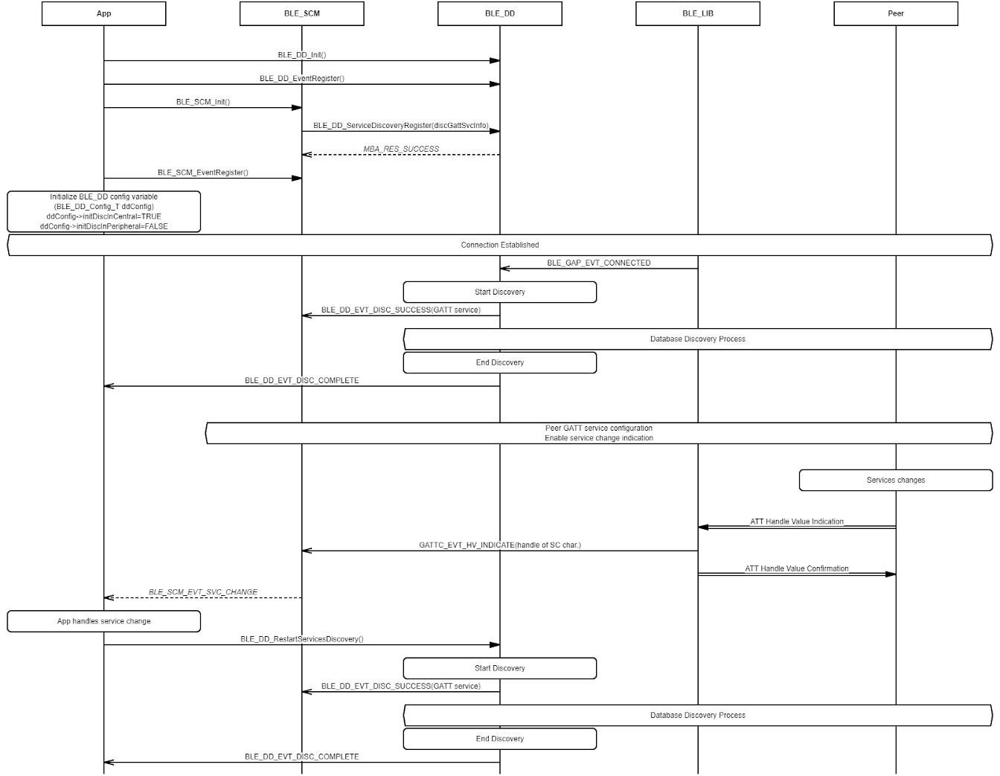
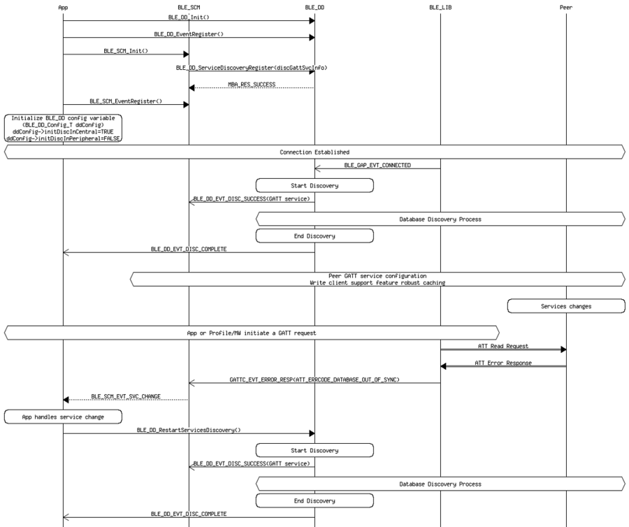

# Database Discovery with BLE\_SCM in Service Change Situation

 

-   Example of receiving service change \(SC\) indication from peer

 

 

-   Example of receiving ATT Database Out Of Sync. error code from peer

 

**Parent topic:**[Message Sequence Chart](GUID-92488830-E17D-4AA1-9A3C-BEC23C905D64.md)

