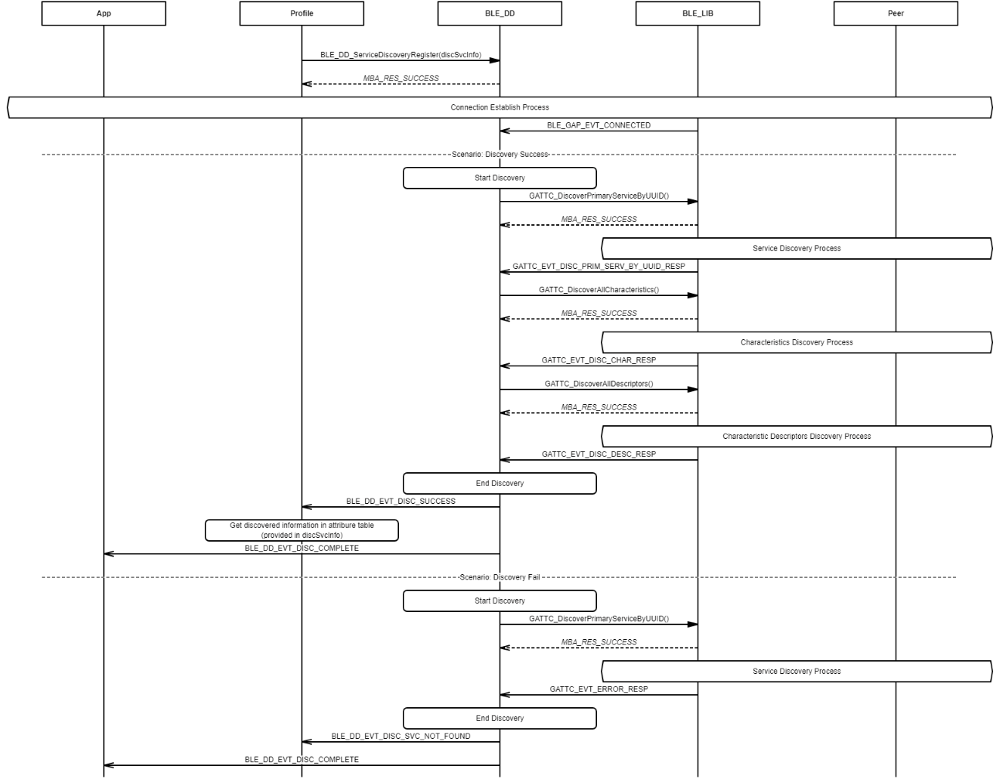
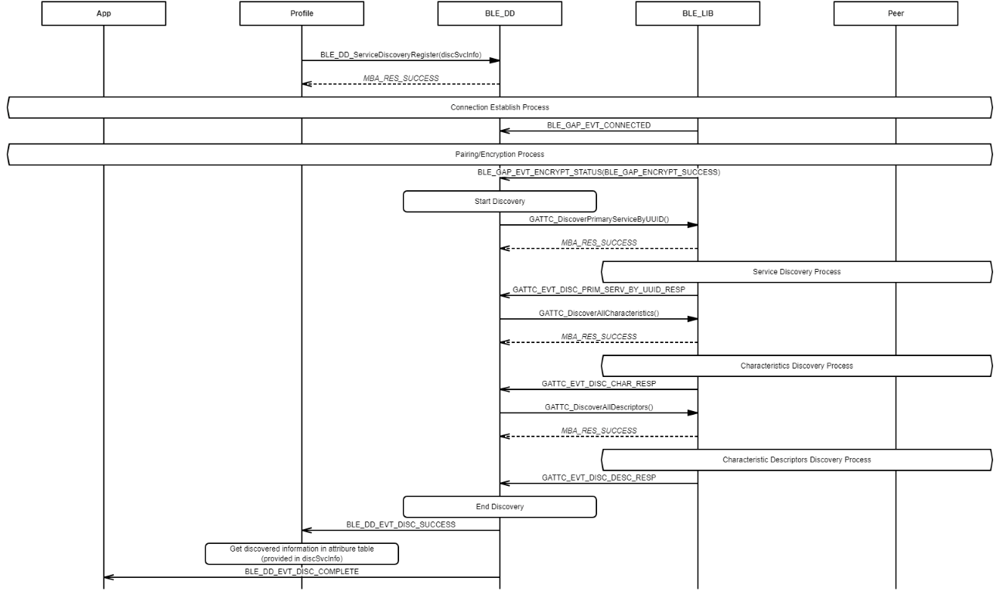
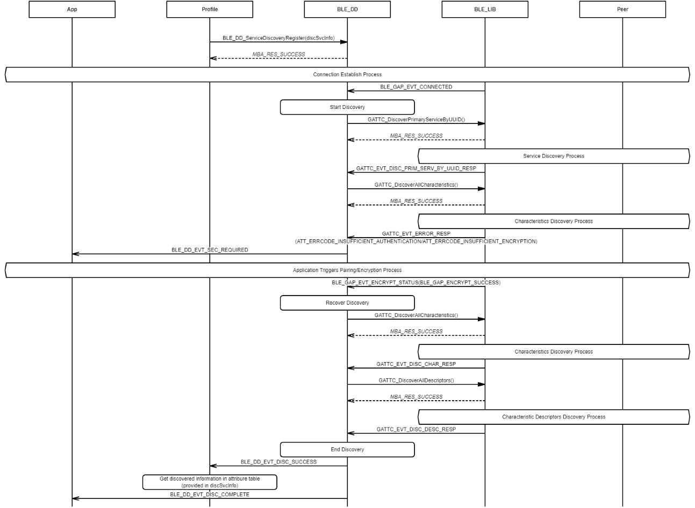

# Database Discovery Process

## Example of database discovery after connected

 

 

## Example of database discovery after connected and paired/encrypted

 

 

## Example of database discovery interrupted by security

 

 

**Parent topic:**[Message Sequence Chart](GUID-7936CFC8-E8CB-4185-BFAA-2F49B1481F07.md)

