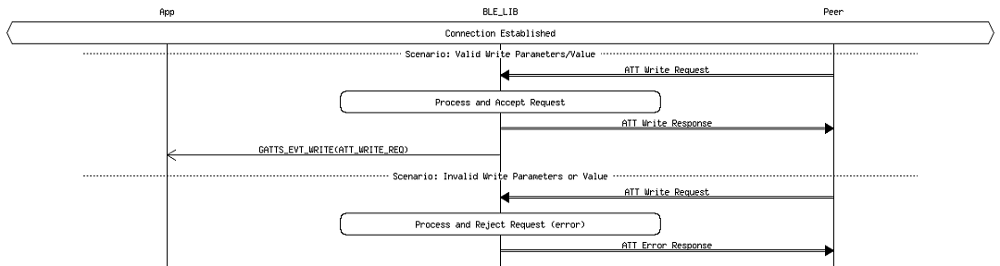
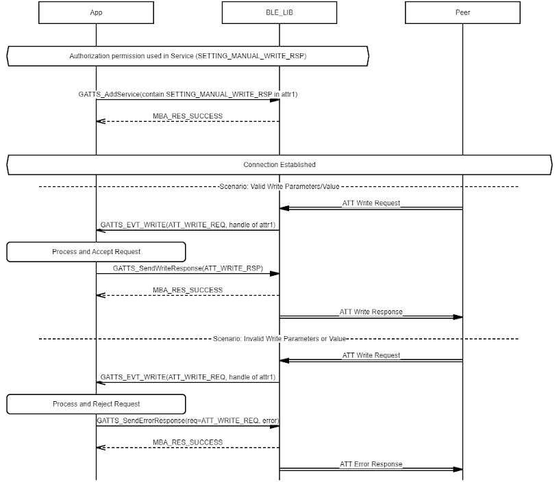
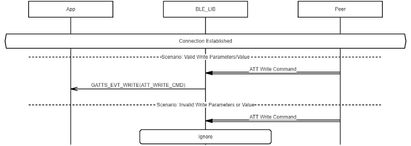

# GATTS Characteristic/Characteristic Descriptor Value Write

## Example of GATTS Characteristic/Characteristic Descriptor Value Write \(Response by BLE\_LIB\)

 

 

## Example of GATTS Characteristic/Characteristic Descriptor Value Write \(Response by Application\)

 

 

## Example of GATTS Characteristic Value Write without Response

 

 

**Parent topic:**[Message Sequence Chart](GUID-4E6414B1-49B8-427C-ACFB-97EF00444F24.md)

