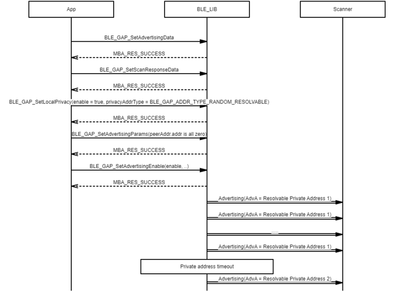
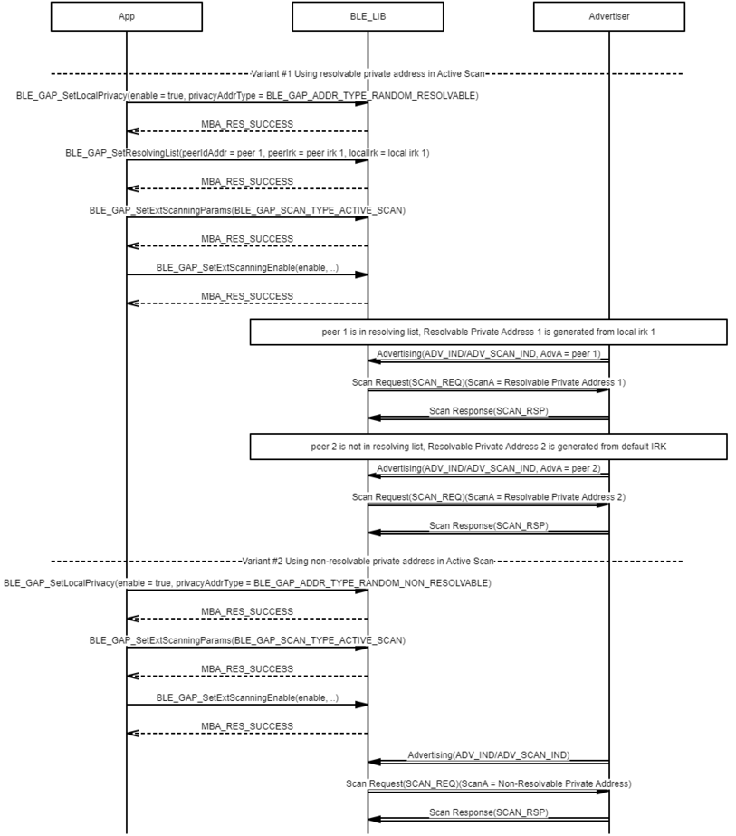
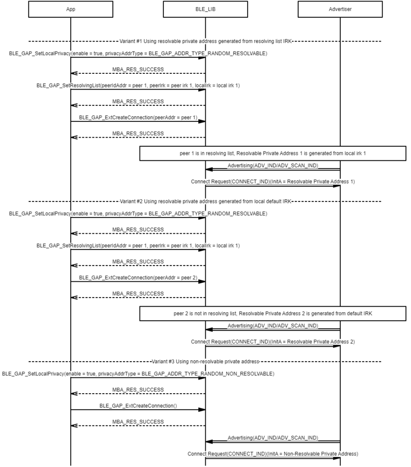

# GAP Privacy procedure

## Example of Privacy Advertising procedure- Using resolvable private address generated from local default IRK

 

 

## Example of Privacy Advertising procedure- Using resolvable private address generated from resolving list IRK

 

 

## Example of Privacy Advertising procedure- Using non-resolvable private address

 

 

## Example of Privacy Extended Advertising procedure- Using resolvable private address generated from local default IRK

 

 

## Example of Privacy Extended Advertising procedure- Using resolvable private address generated from resolving list IRK

 

 

## Example of Privacy Extended Advertising procedure- Using resolvable private address generated from resolving list IRK for 2nd~4th advertising set

 

 

## Example of Privacy Extended Advertising procedure- Using non-resolvable private address

 

 

## Example of Privacy Extended Advertising procedure- Using non-resolvable private address for 2nd~4th advertising set

 

 

## Example of Privacy Scanning procedure

 

 

## Example of Privacy Extended Scanning procedure

 

 

## Example of Privacy Create Connection procedure

 

 

## Example of Privacy Extended Create Connection procedure

 

 

**Parent topic:**[Message Sequence Chart](GUID-1A7E8B4B-B471-43E1-BC73-81D705900D18.md)

