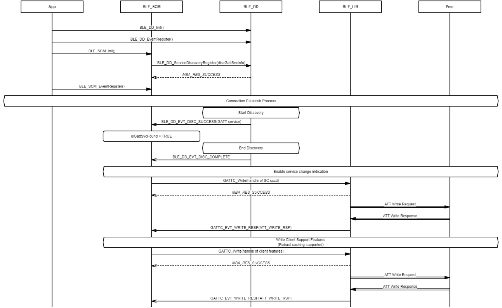

# Configure characteristic of remote GATT service

## Example of configuring GATT service after service is discovered

 

 

**Parent topic:**[Message Sequence Chart](GUID-7259983A-3268-4DAC-AB10-C7A606CD01E9.md)

