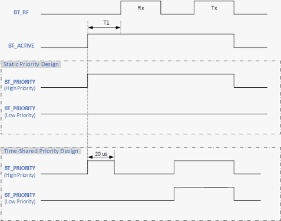

# Appendix 1: Two implementations of BT\_PRIORITY signal

 

-   **Static Priority Design**: It is either high or low during BT\_ACTIVE asserted for Tx or Rx operation.
-   **Time-Shared Priority Design**: It is either high or low for a typical 20 µs duration after BT\_ACTIVE asserted, but switches to low for Rx and high for Tx operation. See below diagram for both Static and Time-Shared BT\_PRIORITY design.

 

**Parent topic:**[BLE PTA](GUID-C76FA981-3CAC-4973-AE4F-8FFEE405F570.md)

