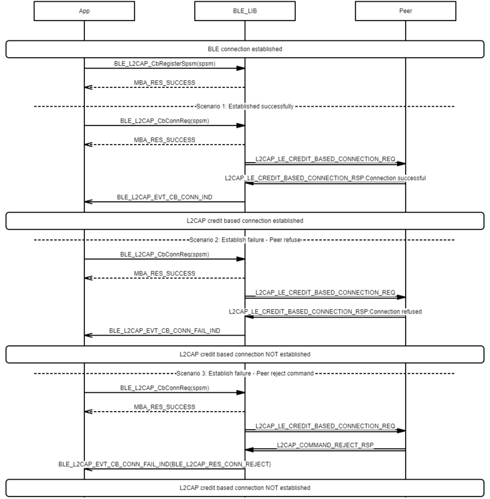
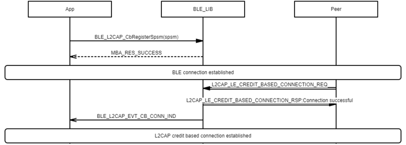
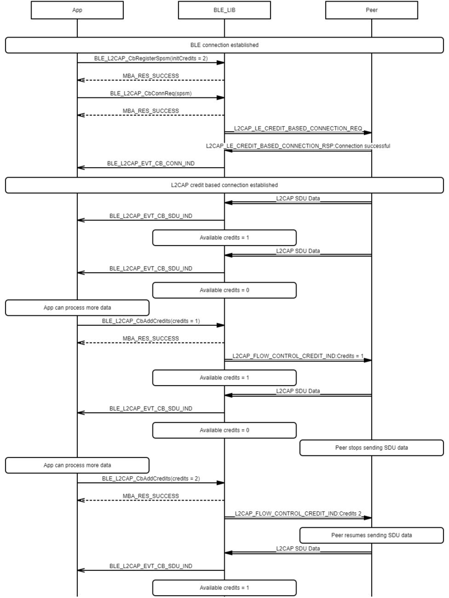
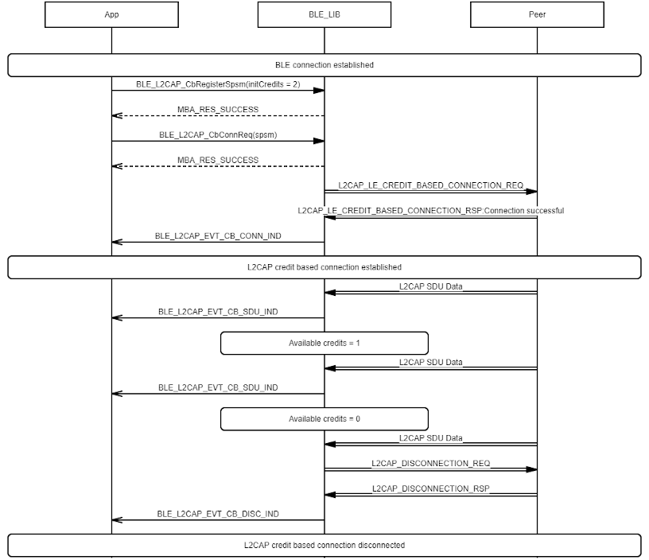

# L2CAP CoC connection procedure

## Example of L2CAP CoC create connection procedure - Local initiated

 

 

## Example of L2CAP CoC create connection procedure - Remote initiated

 

 

## Example of L2CAP CoC local credit calculation and update - Peer stops sending SDU data until App adds credits

 

 

## Example of L2CAP CoC local credit calculation and update - Peer continues sending SDU data before App adds credits

 

 

## Example of L2CAP CoC TX flow based on remote credit

 

 

**Parent topic:**[Message Sequence Chart](GUID-E43CD7B5-B5AE-4019-A8AB-501B2100EB2E.md)

