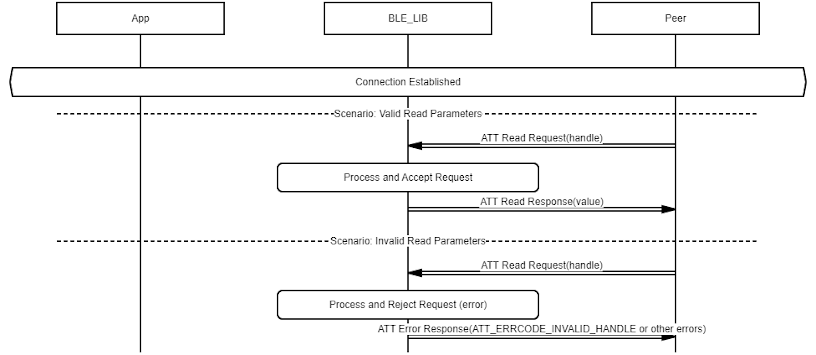
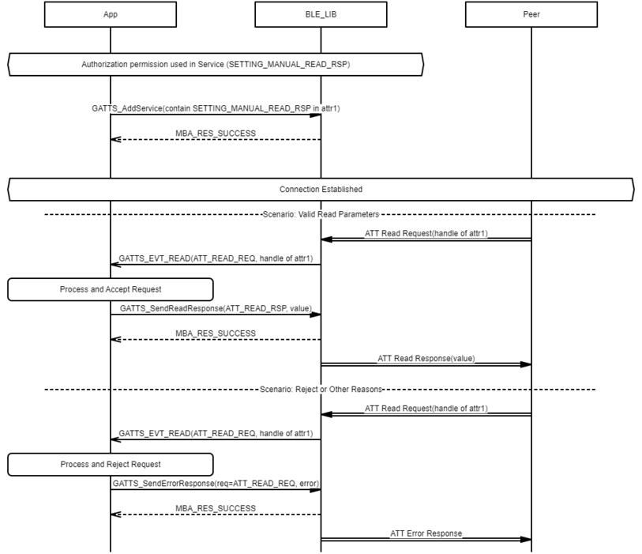

# GATTS Characteristic/Characteristic Descriptor Value Read

## Example of GATTS Characteristic/Characteristic Descriptor Value Read \(Handled by BLE\_LIB\)

 

 

## Example of GATTS Characteristic/Characteristic Descriptor Value Read \(Handled by Application\). Authorization permission case. The permission is accomplished by setting SETTING\_MANUAL\_READ\_RSP on the attribute

 

 

**Parent topic:**[Message Sequence Chart](GUID-4E6414B1-49B8-427C-ACFB-97EF00444F24.md)

