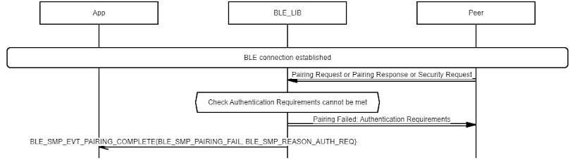

# SMP Pairing Failure Procedure

## Example of SMP Sends Pairing Failed: Encryption Key Size

 

 

## Example of SMP Sends Pairing Failed: Authentication Requirements

 

 

## Example of SMP Sends Pairing Failed: Confirm value failed

 

 

## Example of SMP Sends Pairing Failed: DHKey Check Failed

 

 

## Example of SMP Receives Pairing Failed

 

 

**Parent topic:**[Message Sequence Chart](GUID-DDACB06B-D561-41CB-86EB-E457D3B3E020.md)

