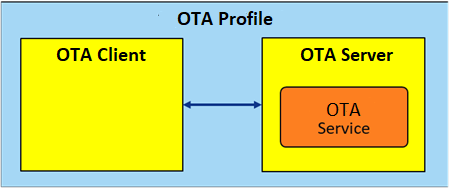

# Role/Service Relationships

OTA Client shall be a GATT Client and GAP Central role and OTA Server shall be a GATT Server and  GAP peripheral role. The following diagram illustrates the relationships between service  and profile roles. An OTA Server shall instantiate the OTA Service [\[1\]](GUID-6B274602-B628-48D8-9345-D483824E66AC.md).

**Parent topic:**[Configuration](GUID-5FBAF639-F6DA-4A3C-BCC1-70EAC76AA65F.md)

