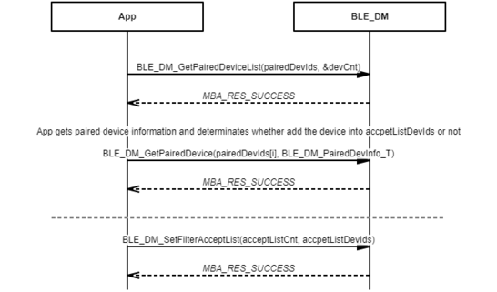

# Filter accept list process

 

-   Example of setting all paired devices to filter accept list

 

 

-   Example of setting partial paired devices to filter accept list

 

**Parent topic:**[Message Sequence Chart](GUID-268D2099-1541-4334-B54F-4C46FBD9A391.md)

